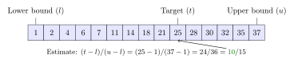
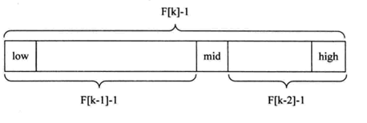

## 查找算法

### 0. 简介

> 在计算机科学中，查找算法是在大量数据中查找某一特定数据的算法。 - [1]

查找，是计算机中最常见的操作之一。数据的增删改查，往往都会伴随查找操作。最常见的查找算法就是顺序查找（也称线性查找），但顺序查找的效率较低，时间复杂度较高。

一般来说，为了提高查找效率，会采用某些数据结构，将数据变得有序，这样便可以使用更为高效的查找算法来降低查找的时间复杂度。比如，二分查找，适用于排序后的数组等结构。

根据查找的性质不同，可以分为：静态查找与动态查找。
 

### 1. 顺序查找

- **基本思想**：顺序查找属于无序查找算法，从数据结构的一端开始，顺序扫描，依次将扫描到的结点关键字与给定值k相比较，若相等则表示查找成功；若扫描结束仍没有找到关键字等于k的结点，表示查找失败。
- **说明**：顺序查找对表中数据元素的存储没有要求。另外，对于线性链表，只能进行顺序查找。
- **复杂度分析**

算法 | 平均时间复杂度 | 最好时间复杂度 | 最坏时间复杂度 | 最坏空间复杂度 |
--- | --- | --- | --- | ---
顺序查找 | O(n/2) | O(1) | O(n) | O(1)
 

 

### 2. 二分查找

- **基本思想**：二分查找属于有序查找算法，每次将需要查找的数值 k 与中间节点的关键字比较。具体步骤如下：
  - 1）将数值 k 与中间节点进行比较，中间节点下标为：mid = (low + high) / 2 = low + 1/2 * (high - low);
  - 2）若相等，则查找成功，结束查找；如果不相等，进入步骤 3;
  - 3）如果 low >= high, 则返回查找失败，结束查找; 否则，如果中间节点数值大于 k， 则 high = mid - 1; 如果中间节点数值小于 k， 则 low = mid + 1; 返回步骤 1。
- **说明**：二分查找的前提条件是需要有序表顺序存储，对于**静态查找表**，一次排序后不再变化，折半查找能得到不错的效率。但对于需要频繁执行插入或删除操作的数据集来说，维护有序的排序会带来不小的工作量，那就不建议使用。
- **复杂度分析**

算法 | 平均时间复杂度 | 最好时间复杂度 | 最坏时间复杂度 | 最坏空间复杂度 |
--- | --- | --- | --- | ---
二分查找 | O(*logn*) | O(1) | O(*logn*) | O(1) 
 

 

### 3. 插值查找

- **基本思想**：基于二分查找算法，将查找点的选择改进为自适应选择，可以提高查找效率。用插值公式计算键值位置。
  - 1）将数值 k 与插值节点进行比较，节点下标为： mid = low + (k - a[low])/(a[high] - a[low]) * (high - low);
  - 2）若相等，则查找成功，结束查找；如果不相等，进入步骤 3;
  - 3）如果 low >= high, 则返回查找失败，结束查找; 否则，如果结点数值大于 k， 则 high = mid - 1; 如果节点数值小于 k， 则 low = mid + 1; 返回步骤 1。
- **说明**：对于表长较大，而**关键字分布又比较均匀的查找表**来说，插值查找算法的平均性能比折半查找要好的多。反之，数组中如果分布非常不均匀，那么插值查找未必是很合适的选择。
- **复杂度分析**

算法 | 平均时间复杂度 | 最好时间复杂度 | 最坏时间复杂度 | 最坏空间复杂度 |
--- | --- | --- | --- | ---
插值查找 | O(*log(logn)*) | O(1) | O(n) | O(1) 
 

 

### 4. 斐波那契查找

- **基本思想**：二分查找的一种提升算法，通过运用黄金比例的概念在数列中选择查找点进行查找，提高查找效率。
  - 1）构建斐波那契数列：可以根据数组长度合适的斐波那契数列。
  - 2）计算数组长度对应的斐波那契数列元素个数：当数组长度不等于斐波那契数列中的任何一个数时，采用的策略是：**大于数组长度的最近一个斐波那契数值**。
  - 3）对数组进行填充：数组长度小于斐波那契数时，需要在数组的最后填充数值，以满足数组长度等于选择的斐波那契数值。填充的数值，一般选择原数组中的最后一个数据。
  - 4）将数值 k 与查找节点进行比较，节点下标为： mid = low + F(n-1) - 1;
  - 5）若相等，则查找成功，结束查找；如果不相等，进入步骤 3;
  - 6）如果 low >= high, 则返回查找失败，结束查找; 否则，如果结点数值大于 k， 则 n = n - 2（因为右区间有 F(n-2) 个元素）， low = mid + 1; 如果节点数值小于 k， 则 n = n - 1（因为左区间有 F(n-1) 个元素）, high = mid - 1; 返回步骤 4。
- **说明**：斐波那契查找与二分查找类似，适合于静态查找表。斐波那契查找在某些满足斐波那契分布的数据上，效率会比二分查找更高一些。
- **复杂度分析**

算法 | 平均时间复杂度 | 最好时间复杂度 | 最坏时间复杂度 | 最坏空间复杂度 |
--- | --- | --- | --- | ---
斐波那契查找 | O(*logn*) | O(1) | O(logn) | O(1) 
 

 

### 5. 分块查找

- **基本思想**：分块查找是顺序查找的一种改进方法，分块查找要求将查找表分成若干个子表，并对子表建立索引表，查找表的每一个子表由索引表中的索引项确定。
  - 1）根据原有数据表（n 个数据），分成 m （0 < m <= n）个块，并建立索引表。
  - 2）先对索引表进行查找，查找 k 值所在的块（根据索引表的特性，可以采取二分查找或顺序查找）。
  - 3）在块内查找目标结点。
- **说明**：分块查找比顺序查找更为高效，通过对数据进行分块，能够提高索引表。分块查找和哈希查找类似，但没有哈希查找好用，实际中用的更多的是哈希查找，但分块查找的思想是值得学习的。
- **复杂度分析**

**TODO：需要确认**
算法 | 平均时间复杂度 | 最好时间复杂度 | 最坏时间复杂度 | 最坏空间复杂度 |
--- | --- | --- | --- | ---
分块查找 | O(m/2 + *log(n/m)*) | O(1) | O(m + *log(n/m)*) | O(n) 
 

 

### 6. 哈希查找

- **基本思想**：哈希查找，是通过构建哈希表的方法来进行查找。
  - 1）用 hash 函数构造哈希表
  - 2）在
- **说明**：哈希表是一个**在时间和空间上做出权衡**的经典例子。如果没有内存限制，那么可以直接将键作为数组的索引。那么所有的查找时间复杂度为O(1)；如果没有时间限制，那么我们可以使用无序数组并进行顺序查找，这样只需要很少的内存。哈希表使用了适度的时间和空间来在这两个极端之间找到了平衡。只需要调整哈希函数算法即可在时间和空间上做出取舍。
- **复杂度分析**

算法 | 平均时间复杂度 | 最好时间复杂度 | 最坏时间复杂度 | 最坏空间复杂度 |
--- | --- | --- | --- | ---
哈希查找 | O(1) | O(1) | O(1) | O(n) 
 

### 7. 树表查找

- **基本思想**
- **说明**
- **复杂度分析**

 

### 分析总结

TODO
- [ ] 分析不同排序方法的特点与适用范围等

参考资料：
- [1] [Search algorithm](https://en.wikipedia.org/wiki/Search_algorithm)
- [2] [七大查找算法](https://www.cnblogs.com/maybe2030/p/4715035.html)
- [3] [Searching Algorithms](https://www.geeksforgeeks.org/searching-algorithms/)
- [4] [Linear search](https://en.wikipedia.org/wiki/Linear_search)
- [5] [Binary search algorithm](https://en.wikipedia.org/wiki/Binary_search_algorithm)
- [6] [Interpolation search](https://en.wikipedia.org/wiki/Interpolation_search)
- [7] [Fractional cascading](https://en.wikipedia.org/wiki/Fractional_cascading)
- [8] [斐波那契查找算法](https://zq99299.github.io/dsalg-tutorial/dsalg-java-hsp/08/04.html)
- [9] [斐波那契查找原理——附python和C++实现](https://zhuanlan.zhihu.com/p/106883697)
- [10] [查找算法](https://www.cnblogs.com/kunhu/p/3634562.html)
- [11] [Hash table](https://en.wikipedia.org/wiki/Hash_table)

