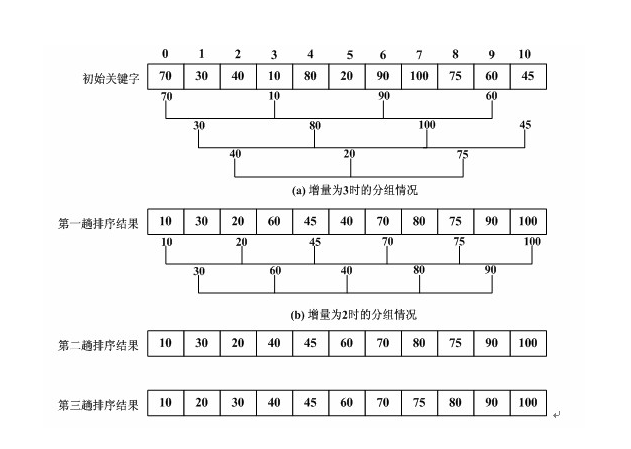
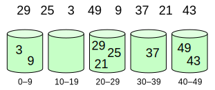
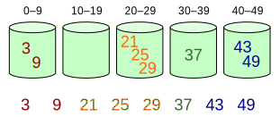

## 排序算法

- [x] 1.理论知识
- [x] 2.分析总结：还可以进一步补充
- [ ] 3.常见编程题练习
- [ ] 4.编程题总结

### **1. 理论知识**

> 在计算机科学与数学中，一个排序算法（英语：Sorting algorithm）是一种能将一串资料依照特定排序方式进行排列的一种算法。 - [1]

排序有内部排序和外部排序，内部排序是数据记录在内存中进行排序，而外部排序是因排序的数据很大，一次不能容纳全部的排序记录，在排序过程中需要访问外存。一般来说，我们说的排序算法是针对内存里的数据进行排序，即内部排序。

通常，可以根据一些特点对排序算法进行分类：
- **时间复杂度**：一般而言，好的性能是 O(nlog n)，坏的性能是 O(n^2)。对于一个排序理想的性能是 O(n)，但平均而言不可能达到。**基于比较的排序算法**对大多数输入而言至少需要 O(nlog n)。使用具有强大计算能力的计算机，能令时间复杂度趋近于 O(n)。
- **稳定性**：稳定排序算法会让原本有相等键值的纪录维持相对次序。也就是如果一个排序算法是稳定的，当有两个相等键值的纪录 R 和 S，且在原本的列表中 R 出现在 S 之前，在排序过的列表中 R 也将会是在 S 之前。
  - 稳定排序：插入排序，冒泡排序，归并排序，桶排序，计数排序。
  - 不稳定排序：希尔排序，选择排序，堆排序，快速排序。
- **排序方法分类**：根据排序中使用的方法，可以将排序算法分为插入、交换、选择、合并等。
- **额外的内存使用**：有些排序算法会使用额外的内存，比如桶排序和计数排序。

参考资料：
- [1] [Sorting algorithm](https://en.wikipedia.org/wiki/Sorting_algorithm)

 

### 1.1 插入排序

一般来说，插入排序都采用in-place在数组上实现。具体算法描述如下 [1]：
- 1.从第一个元素开始，该元素可以认为已经被排序
- 2.取出下一个元素，在已经排序的元素序列中从后向前扫描
- 3.如果该元素（已排序）大于新元素，将该元素移到下一位置
- 4.重复步骤3，直到找到已排序的元素小于或者等于新元素的位置
- 5.将新元素插入到该位置后
- 6.重复步骤2~5

排序过程如下：

排序方法 | 最优 | 平均 | 最差 | 内存占用 | 是否稳定 | 方法 | 补充 
--- | --- | --- | --- | --- | --- | --- |---
插入排序 | n | n^2 | n^2  | 1 | 是 | 插入 | 比较排序

**应用说明**
- 插入排序适合对本身比较有序的数据进行排序，其时间复杂度会接近 于O(n)。
- 插入排序不会占用额外的内存空间。

参考资料：
- [1] [Insertion sort](https://en.wikipedia.org/wiki/Insertion_sort)

 

### 1.2 希尔排序

> 希尔排序（Shellsort），是插入排序的一种更高效的改进版本。希尔排序是非稳定排序算法。 - [1]

希尔算法的主要思路是按照一定的间隔对每组数据进行排序，然后逐渐减少间隔，直到间隔为1,这种方式能够减少比较过程。算法流程如下：
- 1.选择一个合适的间隔 k
- 2.对每组间隔为 k 的数据进行插入排序，即（0, k, 2k, ...) 为一组排序, (1, k+1, 2k+1, ...)依次类推
- 3.调整数据间隔 k
- 4.重复步骤 2, 3 知直到数据间隔为 1

排序过程如下：

排序方法 | 最优 | 平均 | 最差 | 内存占用 | 是否稳定 | 方法 | 补充 
--- | --- | --- | --- | --- | --- | --- |---
希尔排序 | nlogn | n^(4/3) | n^(3/2) | 1 | 否 | 插入 | 比较排序

**应用说明**
- [ ] TODO

参考资料：
- [1] [Shellsort](https://en.wikipedia.org/wiki/Shellsort)
- [2] [经典排序算法（5）——希尔排序算法详解](https://blog.csdn.net/guoweimelon/article/details/50904214)

 

### 1.3 选择排序

选择排序（Selection sort）是一种简单直观的排序算法。它的工作原理如下:
- 1.首先在未排序序列中找到最小（大）元素，存放到排序序列的起始位置
- 2.再从剩余未排序元素中继续寻找最小（大）元素，然后放到已排序序列的末尾。
- 3.以此类推，直到所有元素均排序完毕

排序过程如下：

排序方法 | 最优 | 平均 | 最差 | 内存占用 | 是否稳定 | 方法 | 补充 
--- | --- | --- | --- | --- | --- | --- |---
选择排序 | n^2 | n^2 | n^2 | 1 | 否 | 选择 | 比较排序

参考资料：
- [1] [Selection sort](https://en.wikipedia.org/wiki/Selection_sort)

 

### 1.4 堆排序

> 堆排序（Heapsort）是指利用堆这种数据结构所设计的一种排序算法。堆是一个近似完全二叉树的结构，并同时满足堆的性质：即子节点的键值或索引总是小于（或者大于）它的父节点。 - [1]

算法步骤如下：
- 1.构建最大（小）堆
- 2.将最大（小）堆中取出最大（小）的结点，即根节点与最后一个结点交换，交换后的最后一个结点移出堆
- 3.重新调整剩余数据，保证其维持最大（小）堆的性质
- 4.重复步骤2-3至剩余数据为空

排序过程如下：

排序方法 | 最优 | 平均 | 最差 | 内存占用 | 是否稳定 | 方法 | 补充 
--- | --- | --- | --- | --- | --- | --- |---
堆排序 | nlogn | nlogn | nlogn | 1 | 否 | 选择 | 比较排序

**应用说明**
- 适合于动态变化数据的排序。

参考资料：
- [1] [Heapsort](https://en.wikipedia.org/wiki/Heapsort)

 

### 1.5 冒泡排序

冒泡排序算法的运作如下 [1]：
- 1.比较相邻的元素。如果第一个比第二个大，就交换他们两个。
- 2.对每一对相邻元素作同样的工作，从开始第一对到结尾的最后一对。这步做完后，最后的元素会是最大的数。
- 3.针对所有的元素重复以上的步骤，除了最后一个。
- 4.持续每次对越来越少的元素重复上面的步骤，直到没有任何一对数字需要比较。

排序过程如下：

排序方法 | 最优 | 平均 | 最差 | 内存占用 | 是否稳定 | 方法 | 补充 
--- | --- | --- | --- | --- | --- | --- |---
冒泡排序 | n | n^2 | n^2  | 1 | 是 | 交换| 比较排序

**应用说明**
- 冒泡排序适合于对比较有序的数据进行排序。

参考资料：
- [1] [Bubble sort](https://en.wikipedia.org/wiki/Bubble_sort)

 

### 1.6 快速排序

> 快速排序使用分治法策略来把一个序列分为较小和较大的2个子序列，然后递归地排序两个子序列。 - [1] 

算法步骤为 [1]：
- 1.挑选基准值：从数列中挑出一个元素，称为“基准”（pivot），
- 2.分割：重新排序数列，所有比基准值小的元素摆放在基准前面，所有比基准值大的元素摆在基准后面（与基准值相等的数可以到任何一边）。
- 3.递归排序子序列：递归地将小于基准值元素的子序列和大于基准值元素的子序列排序。

排序过程如下：

排序方法 | 最优 | 平均 | 最差 | 内存占用 | 是否稳定 | 方法 | 补充 
--- | --- | --- | --- | --- | --- | --- |---
快速排序 | nlogn | nlogn | n^2 | logn | 否 | 交换与分治| 比较排序 

**应用说明**
- 快速排序应用比较广泛。
- 快速排序，基准元素的选择比较重要。

参考资料：
- [1] [Quicksort](https://en.wikipedia.org/wiki/Quicksort)

 

### 1.7 归并排序

> 归并排序（Merge sort），是创建在归并操作上的一种有效的排序算法。1945年由约翰·冯·诺伊曼首次提出。该算法是采用分治法（Divide and Conquer）的一个非常典型的应用，且各层分治递归可以同时进行。 - [1]

算法步骤可以分为两种：

（1）递归法（Top-down）
- 1.申请空间，使其大小为两个已经排序序列之和，该空间用来存放合并后的序列
- 2.设定两个指针，最初位置分别为两个已经排序序列的起始位置
- 3.比较两个指针所指向的元素，选择相对小的元素放入到合并空间，并移动指针到下一位置
- 4.重复步骤3直到某一指针到达序列尾
- 5.将另一序列剩下的所有元素直接复制到合并序列尾

（2）迭代法（Bottom-up）（假设序列共有 *n* 个元素）
- 1.将序列每相邻两个数字进行归并操作，形成 *ceil(n/2)* 个序列，排序后每个序列包含两/一个元素
- 2.若此时序列数不是1个则将上述序列再次归并，形成 *ceil(n/4)* 个序列，每个序列包含四/三个元素
- 3.重复步骤2，直到所有元素排序完毕，即序列数为1

排序过程如下：

排序方法 | 最优 | 平均 | 最差 | 内存占用 | 是否稳定 | 方法 | 补充 
--- | --- | --- | --- | --- | --- | --- |--- 
归并排序 | nlogn | nlogn | nlogn | n | 是 | 合并 | 比较排序

**应用说明**
- 归并算法采用了空间换时间的方法，将速度控制 nlogn，属于比较快速的排序。

参考资料：
- [1] [Merge sort](https://en.wikipedia.org/wiki/Merge_sort)

 

### 1.8 桶排序

> 桶排序（Bucket sort）或所谓的箱排序，是一个排序算法，工作的原理是将数组分到有限数量的桶里。每个桶再个别排序. 当要被排序的数组内的数值是均匀分配的时候，桶排序使用线性时间（*O(n)*）。但桶排序并不是比较排序，他不受到 *O(nlogn)* 下限的影响- [1]

桶排序以下列程序进行：
- 1.设置一个定量的数组当作空桶子。
- 2.寻访序列，并且把项目一个一个放到对应的桶子去。
- 3.对每个不是空的桶子进行排序。
- 4.从不是空的桶子里把项目再放回原来的序列中。

排序过程如下：
- 元素分配到桶中

- 对桶中元素排序

排序方法 | 最优 | 平均 | 最差 | 内存占用 | 是否稳定 | 方法 | 补充 
--- | --- | --- | --- | --- | --- | --- |---
桶排序 | n+k  | n+k | n^2 | n*K | 是 | \ | 非比较排序

**应用说明**
- 桶排序，属于典型的空间换时间的方法，对内存的占用比较明显。

参考资料：
- [1] [Bucket sort](https://en.wikipedia.org/wiki/Bucket_sort)

 

### 1.9 计数排序

> 计数排序（Counting sort）是一种稳定的线性时间排序算法。计数排序使用一个额外的数组 *C* ，其中第 *i* 个元素是待排序数组 *A* 中值等于 *i* 的元素的个数。然后根据数组 *C* 来将 *A* 中的元素排到正确的位置。 - [1]

计数排序适合对整数进行排序，当数据变化范围较小时，适合采用这种方式，算法步骤如下：
- 找出待排序的数组中最大和最小的元素
- 统计数组中每个值为 *i* 的元素出现的次数，存入数组 *C* 的第 *i* 项（最小数据如果不是 0，需要进行一定调整）
- 根据数据 *C* 中的统计数据，将数据依次填充到数组 *A* 中， *C[i]* 值表示填充数据 *i* 的个数（如果 *C[i]* 为 0 则不填充至 *A*）。 

排序过程如下：

**应用说明**
- 计数排序适合对整数排序，对浮点数场景，桶排序更适合（类似哈希排序）。

排序方法 | 最优 | 平均 | 最差 | 内存占用 | 是否稳定 | 方法 | 补充 
--- | --- | --- | --- | --- | --- | --- |---
计数排序 | n+k  | n+k | n+k | n+k | 是 | 哈希表 | 非比较排序

参考资料：
- [1] [Counting sort](https://en.wikipedia.org/wiki/Counting_sort)
- [2] [计数排序（Counting Sort）](https://blog.csdn.net/thinkwon/article/details/101544159#:~:text=%E8%AE%A1%E6%95%B0%E6%8E%92%E5%BA%8F(Counting%20sort)%E6%98%AF,%E8%83%BD%E5%AF%B9%E6%95%B4%E6%95%B0%E8%BF%9B%E8%A1%8C%E6%8E%92%E5%BA%8F%E3%80%82)

 
 

### **2. 分析总结**

常见排序算法的性能说明
排序方法 | 最优 | 平均 | 最差 | 内存占用 | 是否稳定 | 方法 | 补充 
--- | --- | --- | --- | --- | --- | --- |---
插入排序 | n | n^2 | n^2  | 1 | 是 | 插入 | 比较排序
希尔排序 | nlogn | n^(4/3) | n^(3/2) | 1 | 否 | 插入 | 比较排序
选择排序 | n^2 | n^2 | n^2 | 1 | 否 | 选择 | 比较排序
堆排序 | nlogn | nlogn | nlogn | 1 | 否 | 选择 | 比较排序
冒泡排序 | n | n^2 | n^2  | 1 | 是 | 交换| 比较排序
快速排序 | nlogn | nlogn | n^2 | logn | 否 | 交换与分治| 比较排序 
归并排序 | nlogn | nlogn | nlogn | n | 是 | 合并 | 比较排序
桶排序 | n+k  | n+k | n^2 | n*K | 是 | \ | 非比较排序
计数排序 | n+k  | n+k | n+k | n+k | 是 | 哈希表 | 非比较排序

排序方法应用说明
- 1.一般来说，快速排序应用范围比较广泛。但是，针对不同的场景，根据数据的特点，某些排序算法可能会更加高效。比如，月份或者星期的统计，计数排序显然会更加高效。
- 2.要理解不同排序方法的应用场景和局限性。比如，快速排序，基准元素的选取就很重要;计数排序，不适合整数排序。
- 3.稳定性也是排序算法选择中需要考虑的一个特点。

 
 

### **3. 常见编程题练习**

- 1.合并区间。
- 2.合并两个有序数组。
- 3.最大数。
- 4.数组中的第K个最大元素。
- 5.最长和谐子序列。
- 6.排序数组。

