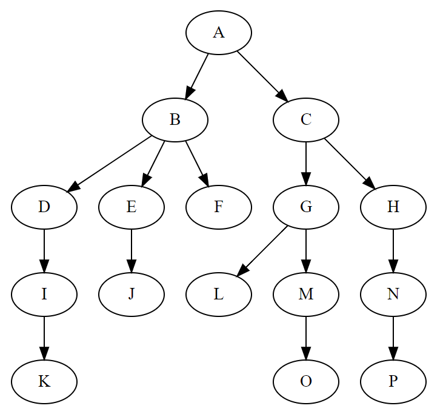
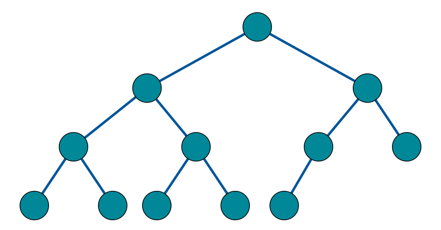
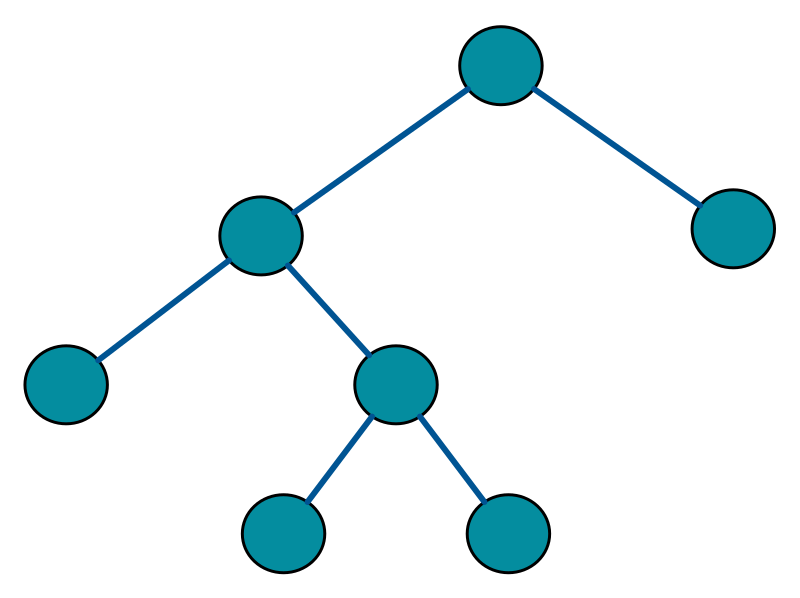

## 树

- [ ] 1.理论知识
- [ ] 2.分析总结
- [ ] 3.常见编程题练习
- [ ] 4.编程题总结

### **1. 理论知识**

### 1.1 简介

> 在计算机科学中，树（英语：tree）是一种抽象数据类型（ADT）或是实现这种抽象数据类型的数据结构，用来模拟具有树状结构性质的数据集合。它是由n（n>0）个有限节点组成一个具有层次关系的集合。 - [1]

一般来说，树具有以下特点：
- 每个节点都只有有限个子节点或无子节点；
- 没有父节点的节点称为根节点；
- 每一个非根节点有且只有一个父节点；
- 除了根节点外，每个子节点可以分为多个不相交的子树；
- 树里面没有环路(cycle)

哈希表的示意图如下所示：

 

### 1.2 树的分类

根据树的特点，可以分为：
- 无序树：树中任意节点的子节点之间没有顺序关系，这种树称为无序树，也称为自由树。
- 有序树：树中任意节点的子节点之间有顺序关系，这种树称为有序树；
  - 二叉树：每个节点最多含有两个子树的树称为二叉树；
    - 完全二叉树
    - 平衡二叉树（AVL树）：
    - 排序二叉树(二叉查找树（英语：Binary Search Tree))
  - 霍夫曼树：带权路径最短的二叉树称为哈夫曼树或最优二叉树；
  - B树：一种对读写操作进行优化的自平衡的二叉查找树，能够保持数据有序，拥有多于两个子树。

 

### 1.3 二叉树

> 在计算机科学中，二叉树（英语：Binary tree）是每个节点最多只有两个分支（即不存在分支度大于2的节点）的树结构。 - [2]

常分支被称作“左子树”或“右子树”。二叉树的分支具有左右次序，不能随意颠倒。

- 树的结点（node）：包含一个数据元素及若干指向子树的分支；
- 孩子结点（child node）：结点的子树的根称为该结点的孩子；
- 双亲结点：B 结点是 A 结点的孩子，则 A 结点是 B 结点的双亲；
- 兄弟结点：同一双亲的孩子结点；
- 堂兄结点：同一层上结点；
- 祖先结点: 从根到该结点的所经分支上的所有结点
- 子孙结点：以某结点为根的子树中任一结点都称为该结点的子孙
- 结点层：根结点的层定义为1；根的孩子为第二层结点，依此类推；
- 树的深度：树中最大的结点层
- 结点的度：结点子树的个数
- 树的度：树中最大的结点度。
- 叶子结点：也叫终端结点，是度为 0 的结点；
- 分枝结点：度不为0的结点；
- 有序树：子树有序的树，比如家族树；
- 无序树：不考虑子树的顺序；

二叉树的常见操作：
- 二叉树的高度
- 二叉树的层次遍历
- 二叉搜索树
- 二叉平衡树

#### 完美二叉树

一个深度为k(>=-1)且有2^(k+1) - 1个结点的二叉树称为完美二叉树。 (注： 国内的数据结构教材大多翻译为"满二叉树")

#### 完全二叉树

对于一棵二叉树，假设其深度为d（d>1）。除了第d层外，其它各层的节点数目均已达最大值，且第d层所有节点从左向右连续地紧密排列，这样的二叉树被称为完全二叉树。

#### 完满二叉树

完满二叉树所有非叶子结点的度都是2。（只要你有孩子，你就必然是有两个孩子。）

#### 平衡二叉树

#### 搜索二叉树

 
 

### **2.分析总结**
- [ ] 分析 hash 表的适用场景

### **3. 编程练习**

参考资料：
- [1] [Tree (data structure)](https://en.wikipedia.org/wiki/Tree_(data_structure))
- [2] [Binary tree](https://en.wikipedia.org/wiki/Binary_tree)
- [3] [完美二叉树, 完全二叉树和完满二叉树](https://www.cnblogs.com/idorax/p/6441043.html)

