## 刚性配准

### 1. 刚性配准

> Image registration is the process of transforming different sets of data into one coordinate system. - [1]

刚性几何配准，一般来说是有两个问题

- 对问题的分析，是解决的问题的方案。

> 仿射变换，是一种保持线性连接和平行关系的几何变换。 - [1]

仿射矩阵

刚性配准中，只包括其中的两种变换：旋转和平移变换。因此，对于刚性配准来说，核心就是求解旋转平移矩阵。

平移矩阵

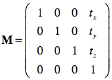

旋转矩阵

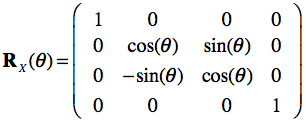
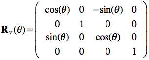
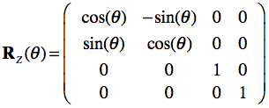

 

参考资料：
- [1] [Affine transformation](https://en.wikipedia.org/wiki/Affine_transformation)
- [2] [Spatial Transformation Matrices](https://www.brainvoyager.com/bv/doc/UsersGuide/CoordsAndTransforms/SpatialTransformationMatrices.html)

### 2. ICP Registration

常见刚性配准算法的目标方程（比如 ICP）：

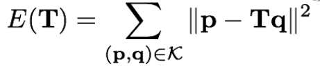

算法流程：

如何求解 R 和 T：
- 测试分析。

参考资料：
- [1] [Efficient Variants of the ICP Algorithm](https://www.cs.princeton.edu/~smr/papers/fasticp/fasticp_paper.pdf)
- [2] [A Method for Registration of 3-D Shapes](https://www.cs.bu.edu/groups/ivc/exam/papers/besl.pdf)

 

### 3. Fast Global Registration

算法流程：

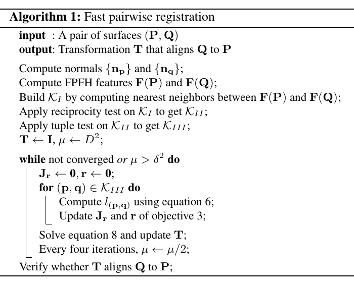

补充说明：
- FPFH 特征是指 Fast Point Feature Histograms，是论文 [6] 中提出的一种方法
- reciprocity test：如果 F(q) 是 F(p) 的最近邻，并接 F(p) 也是 F(q) 的最近邻，则该配对满足reciprocity test。
- tuple test：从筛选过的配对点中，随机选择 3 组，(p1, q1)，(p2, q2)，(p3, q3)，如果满足下面的条件（ τ = 0.9.），则该组点满足 tuple test。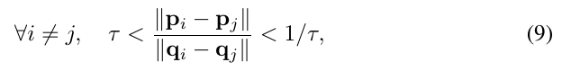

目标方程说明

FGR 的目标方程如（1）所示：

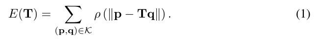

FGR 的目标方程中使用了 ρ(·) 函数，ρ 函数本身具有鲁棒性，对噪声点具有较好的鲁棒性，不需要额外的去噪操作，避免在优化过程中采样（sample）, 验证（validate）, 删减（prune）和重新计算配对关系（recompute correspondences）等费时操作。

ρ 函数，Geman-McClure estimator（M-estimator 中的一种，robust statitics 中常用的方法，是一种鲁棒性函数，**其数学原理尚不清楚**），其公式如（2）所示，该函数在 (0, +oo) 是单调递增的，因此该函数的取最小值时，x 也是最小值，x = ||p - Tq||，即目标方程的最优解与配准算法的最优解具有一致性。

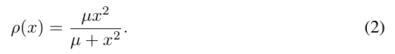

Geman-McClure estimator 的曲线如下所示：

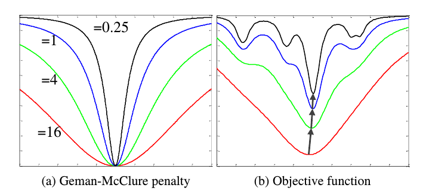

 

FGR 的目标方程直接优化比较难，本文采用了论文 [7] 中提到的 ***Black-Rangarajan duality***
between robust estimation and line processes， L = {lp,q } 是两对应点之间的 line process， 需要优化的目标方程更新为：

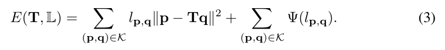

其中：

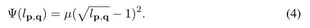

对于 E(T, L) 最优化时，有

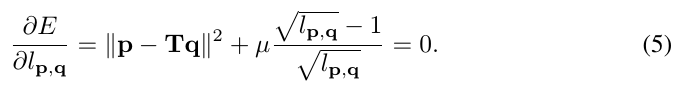

解得方程：

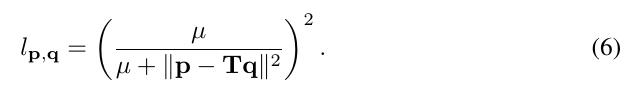

对于方程 3，我们可以使用交替优化的方法来寻找其最小值。

每次迭代优化时，如何求解 T 和 L 
- L：可以根据公式 6 求得
- T：具体求解过程见下（**比较麻烦的部分**）

可以用线性的方式求解 T，令 ξ = (ω, t) = (α, β, γ, a, b, c)

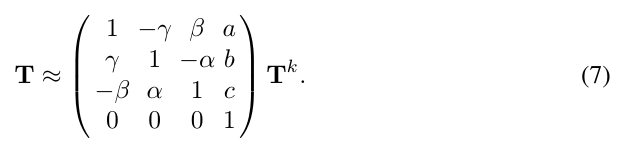

代入 ξ 后，方程 3 是关于 ξ 的最小平方方程，可以用高斯-牛顿方法求解：

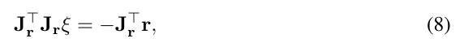

r 是残差向量，Jr 是雅可比矩阵。

#### TODO
- [ ] 为何可以交替优化来寻找最小值：ADMM
- 法向量：如何计算？

参考资料：
- [1] [Image registration](https://en.wikipedia.org/wiki/Image_registration)
- [2] [Fast Global Registration](http://vladlen.info/papers/fast-global-registration.pdf)
- [3] [Robust statistics](https://en.wikipedia.org/wiki/Robust_statistics)
- [4] [M-estimator](https://en.wikipedia.org/wiki/M-estimator)
- [5] [M-estimators](http://www-sop.inria.fr/odyssee/software/old_robotvis/Tutorial-Estim/node24.html)
- [6] [Fast Point Feature Histograms (FPFH) for 3D Registration](https://www.cvl.iis.u-tokyo.ac.jp/class2016/2016w/papers/6.3DdataProcessing/Rusu_FPFH_ICRA2009.pdf)
- [7] [On the Unification of Line Processes, Outlier Rejection, and Robust Statistics with Applications in Early Vision](https://www.cise.ufl.edu/~anand/pdf/ijcv.pdf)

---

### Underspecification

- 泛化性问题，是深度学习和机器学习中的常见问题。
- 很多时候，模型在开发测试数据集上虽然表现很好，但模型并没有按照设想提取到数据的主要特征。实际上，往往提取的是一些不太相关的特征，这些不太相关的特征只是在当前数据集上有效，在其他数据集上是无效的。
- 在图像分类问题中，对数据增加少量的扰动，并不会影响人工的判断，但模型时常会出现意想不到的糟糕结果。这也就是深度学习中出现的 **“明显的错误”**。
- 要解决模型的泛化性能，是需要从更高的层面去思考和准备，而不仅仅是算法开发单方面去解决。
- 开发和使用者需要对模型的应用场景有更为全面的，清楚的，明确的说明，这些说明会涉及到训练数据的搜集，模型的设计，算法策略和测试场景等的调整。

参考资料：
- [1] [How Underspecification Presents Challenges for Machine Learning](https://ai.googleblog.com/2021/10/how-underspecification-presents.html)

