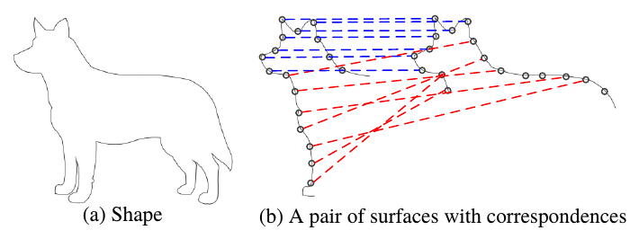

## 刚性配准

### 1. 刚性配准

> Image registration is the process of transforming different sets of data into one coordinate system. - [1]

刚性几何配准，一般来说是有两个问题

- 对问题的分析，是解决的问题的方案。

 

### 2. ICP Registration

 

### 3. Fast Global Registration

- Pairwise Global Registration： 如何实现 Pairwise，具体的步骤是什么？

常见刚性配准算法的目标方程（比如 ICP）：

FGR 的目标方程如（1）所示：

两者的不同之处在于 FGR 不是直接使用距离，而是使用了一个 ρ(·) 函数，一个合适的 ρ 函数可以避免在优化过程中采样（sample）, 验证（validate）, 删减（prune）和重新计算配对关系（recompute correspondences）等费时操作。

FGR 采用了 Geman-McClure estimator（M-estimator 中的一种，robust statitics 中常用的方法，是一种鲁棒性函数，其数学原理尚不清楚），其公式如（2）所示，该函数在 (0, +oo) 是单调递增的，因此该函数的取最小值时，x 也是最小值，x = ||p - Tq||，即两个点集的距离，与常见配准算法的最优解是一致的。

Geman-McClure estimator 的曲线如下所示：

 

两组点云的配准说明：
- 蓝色是正确配对的点
- 红色是错误配对的点，错误配对的点要被抛弃

FGR 的目标方程直接优化比较难，本文采用了 ***Black-Rangarajan duality***
between robust estimation and line processes， L = {lp,q } 是两对应点之间的 line process. 需要优化的目标方程更新为：

其中：

对于方程 3，我们可以使用交替优化的方法来寻找其最小值。

对应关系调整
- 相互性检查（reciprocity test）：如果 F(q) 是 F(p) 的最近邻，并接 F(p) 也是 F(q) 的最近邻，则该配对添加到匹配数据集。
- 多元组兼容性检查（tuple test）：从筛选过的配对点中，随机选择 3 组，(p1, q1)，(p2, q2)，(p3, q3)，如果满足下面的条件（ τ = 0.9.），则该组点被选入匹配数据集。

#### TODO
- [ ] **FPFH 特征提取论文**
- [x] **为什么 ρ 函数能够具有更好的鲁棒性**
- [ ] **为什么使用 line process 来替代原有的优化的过程呢？**
- [ ] **为何可以交替优化来寻找最小值**

参考资料：
- [1] [Image registration](https://en.wikipedia.org/wiki/Image_registration)
- [2] [Fast Global Registration](http://vladlen.info/papers/fast-global-registration.pdf)
- [3] [Robust statistics](https://en.wikipedia.org/wiki/Robust_statistics)
- [4] [M-estimator](https://en.wikipedia.org/wiki/M-estimator)
- [5] [M-estimators](http://www-sop.inria.fr/odyssee/software/old_robotvis/Tutorial-Estim/node24.html)

---

### Underspecification

- 泛化性问题，是深度学习和机器学习中的常见问题。
- 很多时候，模型在开发测试数据集上虽然表现很好，但模型并没有按照设想提取到数据的主要特征。实际上，往往提取的是一些不太相关的特征，这些不太相关的特征只是在当前数据集上有效，在其他数据集上是无效的。
- 在图像分类问题中，对数据增加少量的扰动，并不会影响人工的判断，但模型时常会出现意想不到的糟糕结果。这也就是深度学习中出现的 **“明显的错误”**。
- 要解决模型的泛化性能，是需要从更高的层面去思考和准备，而不仅仅是算法开发单方面去解决。
- 开发和使用者需要对模型的应用场景有更为全面的，清楚的，明确的说明，这些说明会涉及到训练数据的搜集，模型的设计，算法策略和测试场景等的调整。

参考资料：
- [1] [How Underspecification Presents Challenges for Machine Learning](https://ai.googleblog.com/2021/10/how-underspecification-presents.html)

