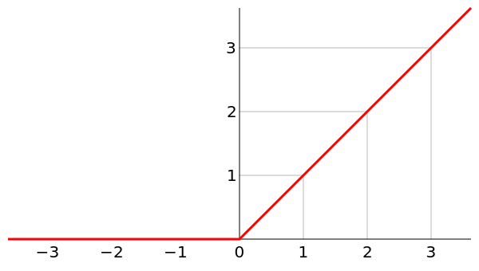
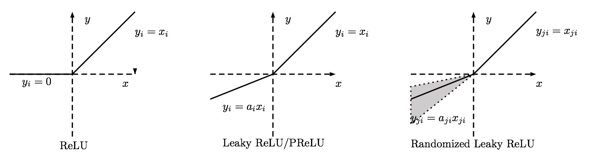
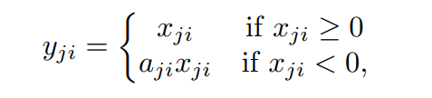
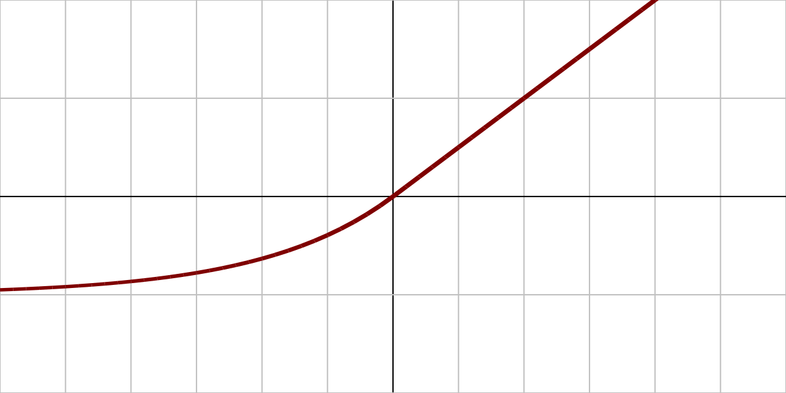
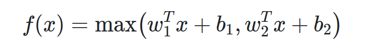

## 激活函数

Update: Nov.05 2020

### 简介

> "在人工神经网络中，激活函数是根据输入定义节点（或神经元）的输出。一般，该输出也会是下一个节点的输入。" - [Activation function](https://en.wikipedia.org/wiki/Activation_function)  

为解决非线性问题（实际中大多数问题都是非线性问题），神经网络中引入了激活函数，给网络结构添加了非线性因素，使其能够处理较为复杂的非线性分类问题。

激活函数一般具有以下性质:
> - 非线性: 当激活函数是线性的时候，一个两层的神经网络就可以逼近基本上所有的函数了。但是，如果激活函数是恒等激活函数的时候，就不满足这个性质了，而且如果多层网络使用的是恒等激活函数，那么其实整个网络跟单层神经网络是等价的。
> - 连续可微: 当优化方法是基于梯度的时候，这个性质是必须的。
> - 范围: 当激活函数输出值是有限的时候，基于梯度的优化方法会更加稳定，因为特征的表示受有限权值的影响更显著；当激活函数的输出是无限的时候，模型的训练会更加高效，不过在这种情况下，一般需要更小的learning rate。
> - 单调性: 当激活函数是单调的时候，单层网络能够保证是凸函数。
> - 导数单调的光滑函数: 在某些情况下，这些已被证明具有更好的泛化性。 
> - 初始时 f(x)≈x: 当激活函数满足这个性质的时候，如果参数的初始化是random的很小的值，那么神经网络的训练将会很高效；如果不满足这个性质，那么就需要很用心的去设置初始值。  
> \- [Activation function](https://en.wikipedia.org/wiki/Activation_function)

想要了解更多，可以阅读：
>[深度学习-从线性到非线性](http://www.shuang0420.com/2017/01/21/%E7%A5%9E%E7%BB%8F%E7%BD%91%E7%BB%9C-%E4%BB%8E%E7%BA%BF%E6%80%A7%E5%88%B0%E9%9D%9E%E7%BA%BF%E6%80%A7/)  

常用的激活函数有:
- Sigmoid
- Tanh
- ReLU
- Leaky ReLU，PReLU、R-ReLU
- ELU
- Maxout
- Softmax
- 其他

 

### Sigmoid
1844年（1845年发表） 就提出来了，经典的激活函数，但是目前使用的不太多。Sigmoid函数单调平滑可导，能够压缩输出数值，但Sigmoid函数左右两端饱和，梯度很小，容易导致梯度损失。除此之外，Sigmoid函数不是关于原点中心对称，函数中的幂运算也相对耗时。

[//]:(sigma(x)=\frac{1}{1+e^{-x})

 

 

### Tanh
与Sigmoid函数很类似，也是经典的激活函数。与Sigmoid函数相比，Tanh改进的地方是函数输出值关于原点中心对称。梯度损失和计算耗时的问题还是存在。

[//]:(tanh(x)=\frac{(e^{x}-e^{-x})}{(e^{x}+e^{-x})})

 

 

### ReLU
ReLU 在深度学习中应用，是由 *Xavier Glorot et al. 2011* 在 [Deep Sparse Rectifier Neural Networks](http://proceedings.mlr.press/v15/glorot11a/glorot11a.pdf) 中提出，其在深度学习上的表现一举超过sigmoid和tanh，并如作者所言，成为一个里程碑，后续深度学习网络大多都采用ReLU作为激活函数。ReLU函数计算复杂度，负类部分置为0，能够稀疏参数，加快收敛速度（SGD），但同时也会导致部分神经元“坏死”，权重无法更新。除此之外，ReLU没有对数据进行幅度压缩，输出也不是关于原点对称。使用ReLU激活，需要小心调整学习率（SGD）。

 

 

### Leaky ReLU, Parameteric ReLU(PReLU), Randomized leaky ReLU(RReLU),
*Bing Xu et al. 2015* 在 [Empirical Evaluation of Rectified Activations in Convolutional Network](https://arxiv.org/abs/1505.00853) 对这几种激活函数进行了分析比较， 他们通过实验比较了这几种ReLU激活函数对分类网络的影响，改善的ReLU比原始ReLU得到的结果要更好，其中RReLU更胜一筹，但是这个结果不一定适用于其他数据集和网络。但可以肯定的是，ReLU并不是激活函数的终结，还会有更合适的激活函数出现。

#### Leaky ReLU
*Maas et al., 2013* 在 [Rectifier Nonlinearities Improve Neural Network Acoustic Models](https://ai.stanford.edu/~amaas/papers/relu_hybrid_icml2013_final.pdf) 中首次提出，比较的结果并没有明显的改善，具体可以阅读原论文。

#### PReLU
由 *Kaiming He et al. 2015* 在 [Delving Deep into Rectifiers: Surpassing Human-Level Performance on ImageNet Classification](https://arxiv.org/abs/1502.01852) 中提出，作者指出这是深度学习算法识别准确率首次超过人类，具体内容可以参考原论文。

#### RReLU
据说是在 *Kaggle NDSB Competition* 中提出，训练时a随机（区间内），测试时取平均值。  

### ELU
*Djork-Arne Clevert et al. 2016* 在 [Fast and Accurate Deep Network Learning by Exponential Linear Units (ELUs)](https://arxiv.org/abs/1511.07289) 提出，在作者的实验中，ELU收敛速度与分类性能表现都更好。ELU缓解了神经元“坏死”的问题，从而能够加快收敛。

 

 

### Maxout
*Ian J. Goodfellow et al. 2013* 在 *Maxout Networks* [6] 提出，作者在论文提到这种激活函数为了与 *dropout* 配合使用，效果不错。

 

### Softmax
softmax与上面的激活函数不同，一般用在网络最后一层，进行多分类。
> "它能将一个含任意实数的K维向量“压缩”到另一个K维实向量中，使得每一个元素的范围都在(0,1)之间，并且所有元素的和为1。" - [19]

 

### 其他
激活函数大概有几百多种，其他的一些激活函数如 SoftSign, SoftPlus等可以参考维基 "[Activation function](https://en.wikipedia.org/wiki/Activation_function)"，里面对这些激活函数做了简要的介绍。

关于常用激活函数的介绍，还可以阅读这篇博客:
- [Activation Functions in Neural Networks](https://isaacchanghau.github.io/post/activation_functions/)

*Dviad* 将一些激活函数进行了可视化绘制，具体可以参考:
- [Visualising Activation Functions in Neural Networks](https://dashee87.github.io/deep%20learning/visualising-activation-functions-in-neural-networks/)

### 常见问题
#### 1.梯度消失  
loss 函数对x求导（也就是梯度），可以理解为 *d(loss)/d(x) = d(loss)/d(y) * d(y)/d(x)*。 *d(y)/d(x)* 也就是激活函数的导数（梯度），如果该结果比较小，向后传递，便会导致梯度损失，甚至消失，训练参数无法得到更新。

#### 2.梯度爆炸
- [ ] TODO

#### 关于原点中心不对称

- [lecun](http://yann.lecun.com/exdb/publis/pdf/lecun-98b.pdf)

### 小结
#### 如何选择激活函数？  
通常，一个网络中尽量使用一种激活函数。哪种激活函数更好，目前并没有明确的定论。

一般来说，可以先尝试 ReLU，但是 ReLU 对学习率比较敏感，需要谨慎选择。
另外，ReLU的改进版Leaky ReLU、 PReLU、 Maxout等也可以尝试一下，改善效果不确定。

非要使用饱和类激活函数时，优先选择 tanh，而不是 sigmoid.

 

### 参考资料
- [1] [Deep Sparse Rectifier Neural Networks](http://proceedings.mlr.press/v15/glorot11a/glorot11a.pdf)
- [2] [Empirical Evaluation of Rectified Activations in Convolutional Network](https://arxiv.org/abs/1505.00853)
- [3] [Rectifier Nonlinearities Improve Neural Network Acoustic Models](https://ai.stanford.edu/~amaas/papers/relu_hybrid_icml2013_final.pdf)
- [4] [Delving Deep into Rectifiers: Surpassing Human-Level Performance on ImageNet Classification](https://arxiv.org/abs/1502.01852)
- [5] [Fast and Accurate Deep Network Learning by Exponential Linear Units (ELUs)](https://arxiv.org/abs/1511.07289)
- [6] [Maxout Networks](https://arxiv.org/abs/1302.4389)
- [7] [Activation function](https://en.wikipedia.org/wiki/Activation_function)
- [8] [Sigmoid function](https://en.wikipedia.org/wiki/Sigmoid_function)
- [9] [Hyperbolic Tangent](http://mathworld.wolfram.com/HyperbolicTangent.html)
- [10] [Rectifier](https://en.wikipedia.org/wiki/Rectifier_(neural_networks))
- [11] [Activation Functions in Neural Networks](https://isaacchanghau.github.io/post/activation_functions/)
- [12] [常用激活函数的总结与比较](https://juejin.im/entry/58a1576e2f301e006952ded1)
- [13] [深度学习中激活函数的优缺点](https://blog.csdn.net/NOT_GUY/article/details/78749509)
- [14] [深度学习-从线性到非线性](http://www.shuang0420.com/2017/01/21/%E7%A5%9E%E7%BB%8F%E7%BD%91%E7%BB%9C-%E4%BB%8E%E7%BA%BF%E6%80%A7%E5%88%B0%E9%9D%9E%E7%BA%BF%E6%80%A7/)
- [15] [The Activation Function in Deep Learning 浅谈深度学习中的激活函数](https://www.cnblogs.com/rgvb178/p/6055213.html)
- [16] [深度学习笔记(三)：激活函数和损失函数](https://blog.csdn.net/u014595019/article/details/52562159)
- [17] [Activation Functions: Neural Networks](https://towardsdatascience.com/activation-functions-neural-networks-1cbd9f8d91d6)
- [18] [Visualising Activation Functions in Neural Networks](https://dashee87.github.io/deep%20learning/visualising-activation-functions-in-neural-networks/)
- [19] [Softmax function](https://en.wikipedia.org/wiki/Softmax_function)

