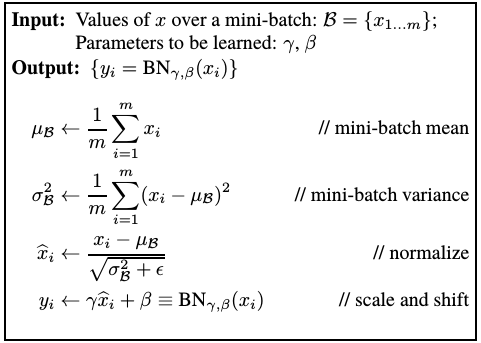

## Batch Normalization

- **Batch Normalization**
  - [ ] Batch Normalization 的定义及细节
  - [ ] Batch Normalization 的作用
  - [ ] BN 及其变种

### 1. Batch Normalization 介绍

Batch Normalization 的大体步骤是：
- 将输入 x 进行归一化（均值和标准差）
- 对归一化后的 x 进行缩放和平移

BN 层本质是去学习缩放参数 gamma（γ） 和 平移参数 beta（β） 的大小

训练和评估中，BN 参数的不同：
- 训练中，gamma 和 beta

 

### 2. Batch Normalization 的作用

BN 层的作用
- 加快网络的训练和收敛的速度
- 控制梯度爆炸防止梯度消失
- 防止过拟合

 

### 3. BN 及其变种

#### 参考资料

- [1] [Batch Normalization: Accelerating Deep Network Training by Reducing Internal Covariate Shift](https://arxiv.org/abs/1502.03167) 
- [2] [【深度学习】一文读懂机器学习常用损失函数（Loss Function）](https://cloud.tencent.com/developer/article/1165263)

