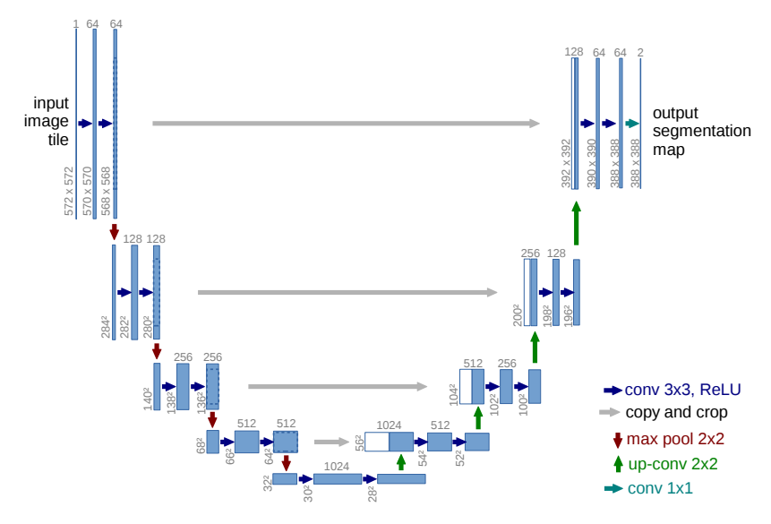
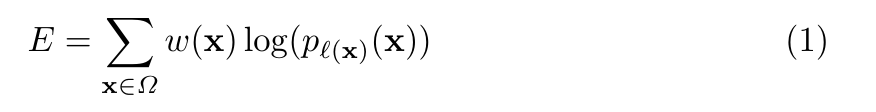
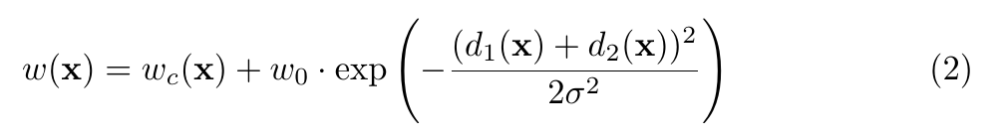
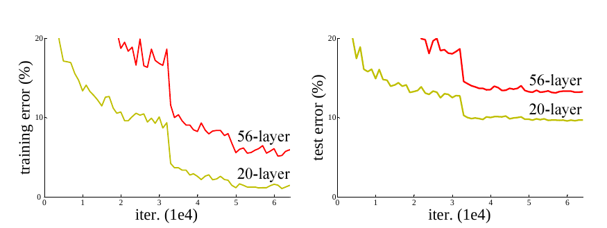
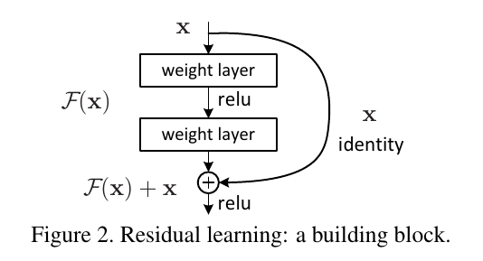
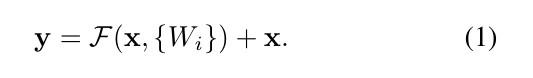
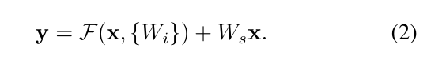
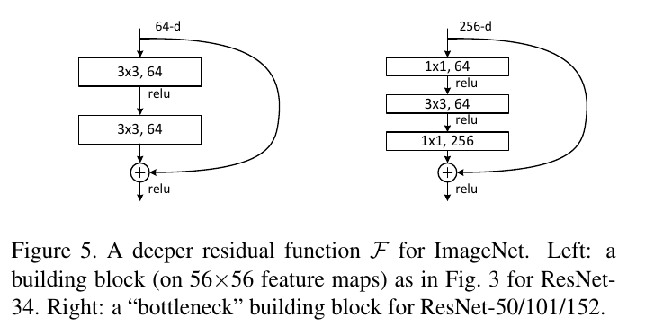
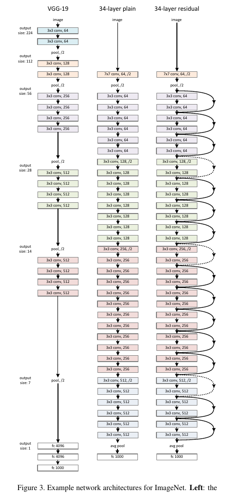

## 图像分割

预估时间：4h

> 在计算机视觉领域，图像分割（segmentation）指的是将数字图像细分为多个图像子区域的过程。图像分割的目的是简化或改变图像的表示形式，使得图像更容易理解和分析。 - [1]

TODO：
- [ ] 传统分割方法了解
- [x] **ResNet**：测试分析
- [ ] **V-Net**：

方法分类：
- 非神经网络方法
  - 二值化
  - 聚类法
  - 直方图法
  - 边缘检测
  - 区域生长
  - 水平集方法
  - 小波变换方法
- 神经网络方法
  - **UNet 系列**： U-Net，ResUNet，VNet

参考资料：
- [1] [Image segmentation](https://en.wikipedia.org/wiki/Image_segmentation)
- [2] [Image Segmentation Using Deep Learning: A Survey](https://arxiv.org/abs/2001.05566)
- [3] [UNet-family](https://github.com/ShawnBIT/UNet-family)
- [4] [Medical Image Segmentation](https://paperswithcode.com/task/medical-image-segmentation)

 

### U-Net

U-Net 发表于 2015 年，是一种全卷积网络，U-Net 的初衷是为了解决生物医学图像方面的问题，由于效果很好后来也被广泛应用在语义分割的各个方向。

**论文梳理**
- 1.模型结构（介绍网络结构，不同之处及其作用，能说明原理最好）
  - 1） U 型网络结构，4 次卷积下采样，4 次反卷积上采样。**为什么这种结构对医学图像分割很有好？？？**
  - 2）浅层特征与深层特征融合，对下采样过程中损失的信息进行补充。上采样过程中，会保留多个特征 channel，保留更多的语义信息。
  - 3）全卷积网络，没有使用全连接层，参数更少，且适应更多不同尺寸的输入。
  - 4）网络层比较简单，包括常见的卷积层，ReLU激活函数，max pooling，以及反卷积层等。
  - 5）网络结构图如下图所示

- 2.损失函数（明确损失函数，网络的输出）
  - 1）U-Net 损失函数采用的是对数损失函数，如公式（1）所示，该损失函数在对数损失函数的基础上增加了一个权重参数。
  - 2）权重是基于边缘距离计算得到，如公式2所示。*d1（x）* 是 x 与最近细胞边缘的距离， *d2（x）* 是 x 距离第二近细胞边缘的距离。
  - 3）*p(x)* 是预测为该类（x）的概率，*softmax* 计算得到。

 

- 3.训练方案
  - 训练数据有限，做了很多数据增广，包括弹性形变。（对于生物医学图像来说，弹性形变是合理的）
- 4.其他

**论文贡献**
- 1）首次提出 U 形网络结构来分割物体，成为经典分割网络(Encoder-Decoder 模式)。
- 2）浅层特征与深层特征相融合，更好的保留细节。
- 3）利用反卷积进行上采样，能保留更多的特征信息。

参考资料：
- [1] [U-Net: Convolutional Networks for Biomedical Image Segmentation](https://arxiv.org/abs/1505.04597)
- [2] [U-Net](https://en.wikipedia.org/wiki/U-Net)
- [3] [U-Net原理分析与代码解读](https://zhuanlan.zhihu.com/p/150579454)

 

### UNet++

### ResNet

论文作者研究中发现，深度学习网络会发生退化（degradation）现象：随着网络层数的增多，训练集 loss 逐渐下降，然后趋于饱和，当你再增加网络深度的话，训练集 loss 反而会增大，如下图所示。

**论文梳理**
- 1.模型结构
  - 1）ResNet 是提出了一种残差结构，如下图 Figure 2 所示。
  - 2）残差结构的数学表达式如公式（1）所示，公式（2）是其变种（实际上应用较少）。直接映射是最好的选择（当 λ > 1 时，会发生梯度爆炸; 当 λ < 1 时，会发生梯度消失。作者在实验中也验证了这一点）。
  - 3）论文中提出了两种残差结构，ResNet34 采用的是 Figure 2 中的结构，也就是 Figure 5 中左边的结构，而 ResNet50/101/152 采用的是 Figure 5 中右边的结构。
  - 4）
  - 5）ResNet34 整体网络结构如下图 Figure 3 所示。

 

 

 

 

- 3.训练方案
- 4.其他

从信息论的角度讲，由于DPI（数据处理不等式）的存在，在前向传输的过程中，随着层数的加深，Feature Map包含的图像信息会逐层减少，而ResNet的直接映射的加入，保证了 [公式] 层的网络一定比 [公式] 层包含更多的图像信息。

**论文贡献**
- 1）残差结构的提出，解决的退化问题。
- 2）计算资源的消耗
- 模型容易过拟合
- 梯度消失/梯度爆炸问题的产生

参考资料：
- [1] [Deep Residual Learning for Image Recognition](https://arxiv.org/abs/1512.03385)
- [2] [Residual neural network](https://en.wikipedia.org/wiki/Residual_neural_network)
- [3] [详解残差网络](https://zhuanlan.zhihu.com/p/42706477)
- [4] [Road Extraction by Deep Residual U-Net](https://arxiv.org/abs/1711.10684)

 

#### VNet

参考资料：
- [1] [V-Net: Fully Convolutional Neural Networks for Volumetric Medical Image Segmentation](https://arxiv.org/abs/1606.04797v1)

