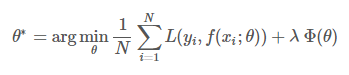

## 损失函数

TODO
- [ ] 定义
- [ ] 作用
- [ ] 常见的损失函数

### 简介

> 损失函数是指一种将一个事件（在一个样本空间中的一个元素）映射到一个表达与其事件相关的经济成本或机会成本的实数上的一种函数，借此直观表示的一些"成本"与事件的关联。 - [1]

在深度学习当中，损失函数是用来评价模型预测值和真实值之间的差别程度。通常来说，损失函数是最优化问题的目标函数，或为其负值。

为了避免过拟合，通常采用结构化风险函数来作为优化收敛的目标函数。结构化风险函数公式如下图所示，公式中的第1项是经验风险函数，也就是我们常说的损失函数，而第二项是正则项（用来避免过拟合）。

根据损失函数的应用领域，根据任务不同，可以分为：
- 回归损失函数
- 分类损失函数

常见的损失函数有：
- 0-1 损失函数
- L1 loss：MAE（Mean Absolute Error）：也称 
- L2 loss
- Smooth L1 loss
- 
- log 损失函数
- 平方损失函数
- 指数损失函数
- Hinge损失函数
- 交叉熵损失函数
- focal loss
- 感知损失
- dice

### 

### 常见的损失函数

### 正则化函数

为什么说正则项可以避免过拟合呢？
> 一般来说，拟合过程中通常都倾向于让权值尽可能小，最后构造一个所有参数都比较小的模型。因为一般认为参数值小的模型比较简单，能适应不同的数据集，也在一定程度上避免了过拟合现象。可以设想一下对于一个线性回归方程，若参数很大，那么只要数据偏移一点点，就会对结果造成很大的影响；但如果参数足够小，数据偏移得多一点也不会对结果造成什么影响，专业一点的说法是抗扰动能力强。 - [3]

### 比较分析

#### 参考资料

- [1] [Loss function](https://en.wikipedia.org/wiki/Loss_function) 
- [2] [【深度学习】一文读懂机器学习常用损失函数（Loss Function）](https://cloud.tencent.com/developer/article/1165263)
- [3] [深入理解L1、L2正则化](https://www.cnblogs.com/zingp/p/10375691.html#_label3)
- [4] [一文看尽深度学习中的各种损失函数](https://bbs.cvmart.net/articles/4879)

一般步骤：
- loss 的定义
- loss 的特点
- 常见的loss
- 比较与建议
