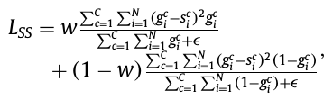

## 损失函数

TODO
- [ ] 定义
- [ ] 作用
- [ ] 常见的损失函数

### 简介

> 损失函数是指一种将一个事件（在一个样本空间中的一个元素）映射到一个表达与其事件相关的经济成本或机会成本的实数上的一种函数，借此直观表示的一些"成本"与事件的关联。 - [1]

在深度学习当中，损失函数是用来评价模型预测值和真实值之间的差别程度。通常来说，损失函数是最优化问题的目标函数，或为其负值。

为了避免过拟合，通常采用结构化风险函数来作为优化收敛的目标函数。结构化风险函数公式如下图所示，公式中的第1项是经验风险函数，也就是我们常说的损失函数，而第二项是正则项（用来避免过拟合）。

根据深度学习模型的应用领域，可以分为：
- 回归损失函数
- 分类损失函数

根据深度学习任务的不同，可以分为：
- 分类
- 分割
- 检测

常见的损失函数有：
- 0-1 损失函数
- L1 loss（MAE，Mean Absolute Error）：绝对值误差
- L2 loss（MSE，Mean Sqaure Error）：平方误差
- Smooth L1 loss：平滑的 L1 损失
- 指数损失函数：
- Hinge损失函数
- 感知损失

### Medical Image Segmentation

医学影像分割 loss 可以分为下面几类：
- Distribution-based Loss：基于分布的损失函数，反映的是两组数据分布的差别。
- Region-based Loss：基于区域的损失函数，反映的是两个区域重叠大小。
- Boundary-based Loss：基于边缘的损失函数，反映的是边缘的距离大小。
- Compound Loss：上面几种损失函数的组合。

#### **Distribution-based Loss**

损失函数 | 公式 | 说明
--- | --- | ---
Cross Entropy (CE) |  | 源于 KL 散度，反映预测数据和真实数据的分布差别
Weighted Cross Entropy (WCE) |  | CE 的变种，针对不同类别数据量不平衡作出的改进
TopK loss (thr) |   | CE 的变种，针对困难样本的改进，强迫模型关注困难样本的学习（低于某个阈值为困难样本） | 
TopK loss (k%) |   | 同上（最差的 k% 为困难样本） | 
Focal loss |   | CE 的变种，针对困难样本的改进，困难样本 loss 更高 (取 γ = 2)  
Distance map Penalized Cross Entropy (DPCE) |  | CE 的变种，针对难分边界的改进，给予边缘像素更大的权重，Dc 是距离变换后计算得到

 

#### **Region-based Loss**

损失函数 | 公式 | 说明
--- | --- | ---
Sensitivity-Specificity (SS) |  | 
Dice Similarity Coefficient (DSC) |  | 最常用

 

#### **Boundary-based Loss**

 

#### **Compound Loss**

### 常见的损失函数

### 正则化函数

为什么说正则项可以避免过拟合呢？
> 一般来说，拟合过程中通常都倾向于让权值尽可能小，最后构造一个所有参数都比较小的模型。因为一般认为参数值小的模型比较简单，能适应不同的数据集，也在一定程度上避免了过拟合现象。可以设想一下对于一个线性回归方程，若参数很大，那么只要数据偏移一点点，就会对结果造成很大的影响；但如果参数足够小，数据偏移得多一点也不会对结果造成什么影响，专业一点的说法是抗扰动能力强。 - [3]

常见的正则化函数
- L1 正则化函数
- L2 正则化函数

### 比较分析

#### 参考资料

- [1] [Loss function](https://en.wikipedia.org/wiki/Loss_function) 
- [2] [【深度学习】一文读懂机器学习常用损失函数（Loss Function）](https://cloud.tencent.com/developer/article/1165263)
- [3] [深入理解L1、L2正则化](https://www.cnblogs.com/zingp/p/10375691.html#_label3)
- [4] [一文看尽深度学习中的各种损失函数](https://bbs.cvmart.net/articles/4879)
- [5] [三要素之策略-损失函数](https://kangcai.github.io/2018/11/21/ml-overall-6-strategy-loss/)
- [6] [Loss odyssey in medical image segmentation](https://www.sciencedirect.com/science/article/abs/pii/S1361841521000815)
- [7] [Loss functions for image segmentation](https://github.com/JunMa11/SegLoss)
- [8] [一文搞懂交叉熵损失](https://www.cnblogs.com/wangguchangqing/p/12068084.html)

一般步骤：
- loss 的定义
- loss 的特点
- 常见的loss
- 比较与建议
