## 损失函数

TODO
- [ ] 理论知识
- [ ] 常见问题分类

- **损失函数**
  - [ ] 损失函数的定义和目的
  - [ ] 常见的损失函数：
  - [ ] 如何设计损失函数

### 1. 损失函数简介

> 损失函数是指一种将一个事件（在一个样本空间中的一个元素）映射到一个表达与其事件相关的经济成本或机会成本的实数上的一种函数，借此直观表示的一些"成本"与事件的关联。 - [1]

在深度学习当中，损失函数是用来评价模型预测值和真实值之间的差别程度。通常来说，损失函数是最优化问题的目标函数，或为其负值。

为了避免过拟合，通常采用结构化风险函数来作为优化收敛的目标函数。结构化风险函数公式如下图所示，公式中的第1项是经验风险函数，也就是我们常说的损失函数，而第二项是正则项（用来避免过拟合）。

如何自定义损失函数：
- 需要满足哪些条件
- 损失函数的前向传输
- 损失函数的反向传导

前向传播：给定输入，求得输出结果。
- 按照网络层，从前往后一层一层的计算，得到最后输出层的结果。

反向传播：给定输出，求得网络的梯度。（主要用于优化过程中）

 

### 2. 损失函数的分类

根据深度学习模型的应用领域，可以分为：
- 回归损失函数
- 分类损失函数

根据深度学习任务的不同，可以分为：
- 分类损失函数
- 分割损失函数
- 检测损失函数

 

### 2. 常见的损失函数

常见的损失函数有：
- 0-1 损失函数
- L1 loss（MAE，Mean Absolute Error）：绝对值误差
- L2 loss（MSE，Mean Sqaure Error）：平方误差
- Smooth L1 loss：平滑的 L1 损失
- 指数损失函数
- Hinge损失函数
- 感知损失

### 3. 不同类型的损失函数

#### **Medical Image Segmentation**

医学影像分割 loss 可以分为下面几类：
- Distribution-based Loss：基于分布的损失函数，反映的是两组数据分布的差别。
- Region-based Loss：基于区域的损失函数，反映的是两个区域重叠大小。
- Boundary-based Loss：基于边缘的损失函数，反映的是两个区域边缘的距离大小。
- Compound Loss：上面几种损失函数的组合。

#### **Distribution-based Loss**

损失函数 | 公式 | 说明
--- | --- | ---
Cross Entropy (CE) |  | 源于 KL 散度，反映预测数据和真实数据的分布差别
Weighted Cross Entropy (WCE) |  | CE 的变种，针对不同类别数据量不平衡作出的改进
TopK loss (thr) |   | CE 的变种，针对困难样本的改进，强迫模型关注困难样本的学习（低于某个阈值为困难样本） | 
TopK loss (k%) |   | 同上（最差的 k% 为困难样本） | 
Focal loss |   | CE 的变种，针对困难样本的改进，困难样本 loss 更高 (取 γ = 2)  
Distance map Penalized Cross Entropy (DPCE) |  | CE 的变种，针对难分边界的改进，给予边缘像素更大的权重，Dc 是距离变换后计算得到

 

#### **Region-based Loss**

损失函数 | 公式 | 说明
--- | --- | ---
Sensitivity-Specificity (SS) |  | 给予敏感性和特异性不同的权重来处理类别间的不平衡问题
Dice  |  | Dice 相似性系数，该损失函数处理类别不平衡的问题
Dice - square  | 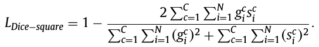 | 同上（不同的是，分母各项取了平方）
Intersection over Union (IoU) | 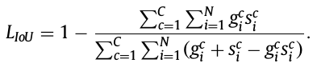 | 交并比（也称 Jaccard），与 Dice 类似的分割指标
Lovász | 
Tversky | 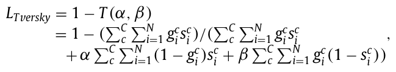 | Dice 的改进，更关注 false negtive, 在精准率和召回率之间权衡(α 和 β 来调整)
Generalized Dice (GD) |  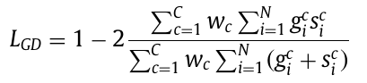 | Dice 的改进，不同类别的物体给予不同的权重，数量少的物体权重大
Focal Tversky loss (FTL) | 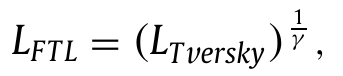 | Tversky 的改进，更关注困难样本的学习 (γ ∈ [1, 3])
Asymmetric similarity | 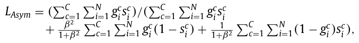 | Dice 的改进，调整 FP 和 FN 的权重，在精准率和召回率中达到更好的平衡 (β 推荐值为 1.5)
Penalty loss | 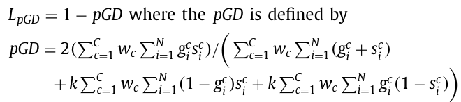 | GD 的改进，增加对 FN 和 FP 的权重 (k 推荐值为 2.5)

 

#### **Boundary-based Loss**

损失函数 | 公式 | 说明
--- | --- | ---
Boundary (BD) loss | 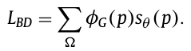 | Boundary loss，该函数通过计算预测和金标间不一致区域的面积来近似表示边缘距离
Hausdorff Distance (HD) | 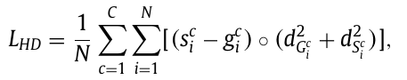 | HD 是基于边缘的评估指标，直接应用 HD 比较难训练，本函数采用了距离变换的方法， dG 和 dS 是通过距离变换计算得到。

说明：Boundary-based Loss 一般是需要与 Region-based Loss 配合使用。

 

#### **Compound Loss**

损失函数 | 公式 | 说明
--- | --- | ---
Combo loss | 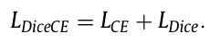 | CE 和 Dice 两者之和
Exponential Logarithmic loss (ELL) | 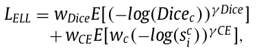 | 为了解决物体尺寸不平衡的问题，采用对数和指数形式，同时综合了 Dice 和 CE
Dice loss with focal loss | 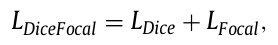 | 增加对分割较差物体的惩罚，在 Dice 基础上增加 Focal loss 作为新的损失函数
Dice loss with TopK loss | 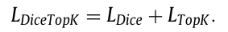 | Dice 和 TopK 之和

 

### 常见的损失函数

### 正则化函数

为什么说正则项可以避免过拟合呢？
> 一般来说，拟合过程中通常都倾向于让权值尽可能小，最后构造一个所有参数都比较小的模型。因为一般认为参数值小的模型比较简单，能适应不同的数据集，也在一定程度上避免了过拟合现象。可以设想一下对于一个线性回归方程，若参数很大，那么只要数据偏移一点点，就会对结果造成很大的影响；但如果参数足够小，数据偏移得多一点也不会对结果造成什么影响，专业一点的说法是抗扰动能力强。 - [3]

常见的正则化函数
- L1 正则化函数
- L2 正则化函数

### 比较分析

#### 参考资料

- [1] [Loss function](https://en.wikipedia.org/wiki/Loss_function) 
- [2] [【深度学习】一文读懂机器学习常用损失函数（Loss Function）](https://cloud.tencent.com/developer/article/1165263)
- [3] [深入理解L1、L2正则化](https://www.cnblogs.com/zingp/p/10375691.html#_label3)
- [4] [一文看尽深度学习中的各种损失函数](https://bbs.cvmart.net/articles/4879)
- [5] [三要素之策略-损失函数](https://kangcai.github.io/2018/11/21/ml-overall-6-strategy-loss/)
- [6] [Loss odyssey in medical image segmentation](https://www.sciencedirect.com/science/article/abs/pii/S1361841521000815)
- [7] [Loss functions for image segmentation](https://github.com/JunMa11/SegLoss)
- [8] [一文搞懂交叉熵损失](https://www.cnblogs.com/wangguchangqing/p/12068084.html)
- [9] [Hausdorff Distance(豪斯多夫距离)](https://www.cnblogs.com/icmzn/p/8531719.html)
- [10] [Hausdorff distance between convex polygons](http://cgm.cs.mcgill.ca/~godfried/teaching/cg-projects/98/normand/main.html)

