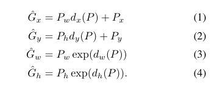
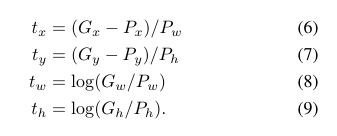
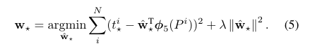
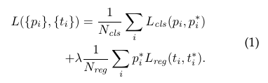
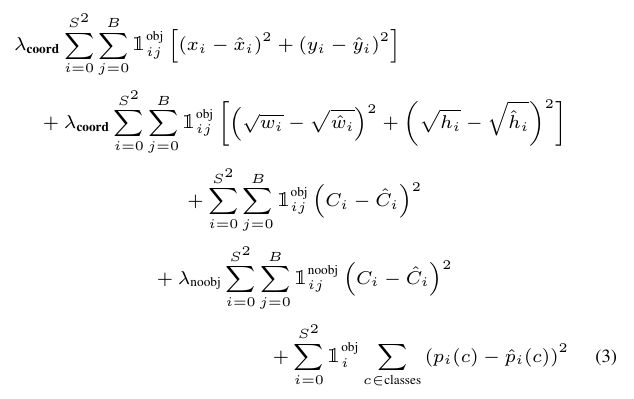

## 目标检测

预估时间：6h

> 目标检测是利用计算机视觉和图像处理技术，检测数字图像或者视频中特定类型的语义物体。 - [1]

方法分类：
- 非神经网络方法
  - Harr 特征
  - SIFT 特征
  - HOG 特征
- 神经网络方法
  - [x] **Region Proposals系列**
    - [x] R-CNN
    - [x] Fast R-CNN
    - [x] Faster R-CNN
  - [ ] **SSD**
  - [ ] **YOLO 系列**
  - RefineDet
  - Retina-Net
  - Deformable convolutional networks 

参考资料：
- [1] [Object detection](https://en.wikipedia.org/wiki/Object_detection)

 

**待完成**
- [ ] Selective Search:
- [ ] ROI pooling：
- [ ] 线性回归和非线性回归

### 1. Region Proposal 系列

RCNN [1], Fast RCNN [2], Faster RCNN [3], cascade RCNN 都是基于 region proposal 方法来进行目标检测。

#### **RCNN**
RCNN 将 CNN 方法引入目标检测领域， 大大提高了目标检测效果，可以说改变了目标检测领域的主要研究思路。后续的 Fast RCNN, Faster RCNN 等都是该系列文章。

RCNN 算法流程如下：
- 1.候选区域生成： 一张图像生成1K~2K个候选区域（采用Selective Search 方法）
- 2.特征提取： 对每个候选区域，使用深度卷积网络提取特征（CNN）
- 3.类别判断： 特征送入每一类的SVM 分类器，判别是否属于该类
- 4.位置精修： 使用回归器精细修正候选框位置

论文的贡献：
- 速度：一般的目标检测方法是采用滑动窗口法来判断所有可能的区域，本文采用 Selective Search 方法预先提取一系列较可能是物体的候选区域。
- CNN 网络提取特征和有监督的训练：以往的目标检测算法一般都是提取人工设定的特征，本文采用神经网络的方法提取深度特征，并通过有监督的方法训练模型。

**TODO**
- [ ] Selective Search

**Bounding box regression**
- 方程（1）（2）中 dx，dy 分别乘以了 Pw 和 Ph，主要原因是 CNN 具有尺度不变性，为了确保不同尺度上的特征具有一致性，因此没有使用 x，y 的直接差，而是采用了宽高（Pw, Ph）的相对差。
- 方程（3）（4）使用了指数形式，主要原因是尺度缩放必须是正数。
- 从方程 1-4 可以看出，dx, dy, dw, dh 是主要求得的未知量。因此，结合方程 6-9 可以确定 bbox 回归的目标方程为：（5）
- 当 x → 0 时，有 *log(1+x)  = x*，因此 bbox 回归一般需要 IoU 较大时，才可以用线性回归模型解决该问题。

 

 

#### **Fast RCNN**

Fast RCNN 是基于 RCNN 网络的改进，进一步简化了算法训练的流程，提高算法运行速度和表现。

Fast RCNN 算法流程如下：
- 1.候选区域生成： 一张图像生成 1k-2k 个候选区域（采用Selective Search 方法）
- 2.准备数据和金标训练网络：将特征提取，目标检测（包括分类）和 bbox 回归整合到一个网络结构中，进行训练。

**TODO**
- [ ] **ROI pooling**

论文的贡献：
- 一次性训练，使用多任务 loss，节省时间和资源：将之前的特征提取，类别判断和位置调整等过程整合在一个网络训练过程中。
- 提出一个 RoI 层：SPP 是 pooling 成多个固定尺度，RoI 只 pooling 到单个固定的尺度。

一些实验结果：
- 网络末端同步训练的分类和位置调整，提升准确度
- 使用多尺度的图像金字塔，性能几乎没有提高
- 倍增训练数据，能够有2%-3%的准确度提升
- 网络直接输出各类概率(softmax)，比SVM分类器性能略好
- 更多候选窗不能提升性能

#### **Faster RCNN**

Faster RCNN 是基于 Fast RCNN 网络的进一步改进，该网络将候选区域生成整合到整个训练网络流程中，进一步简化了网络结构生成，基本实现了端到端的训练过程。

算法流程如下：
- 准备训练数据和金标
- 深度学习网络训练，包括：region proposal, feature extraction, classification + bbox regression.
- 测试验证结果

论文的贡献：
- RPN 的提出
- 实现了端到端的训练过程，算法训练效率大大得到提高
- 准确性进一步提高

**Regrion proposal network**

- RPN 的 loss (公式 1)有两个：分类和 bbox 回归。这里的分类是二分类，即判断是否为物体，bbox 回归与 RCNN 中的 bbox 是一致的。实际上，RPN 得到的 bbox 坐标是基于 anchor（最大 IoU 的 anchor） 尺寸修正过的，这点与 selective search 是不同的。
- 每个特征点取 k 个 anchor， anchor 的设定取决与 anchor size 和 scale ratio 有关，论文中 anchor size 为 （128, 256, 512） 3 个尺寸，scale ratio 为（1:1, 1:2, 2:1）
- 正负样本选择：为了保证负类样本过多，每次计算 loss 的时候只选择一定数量的负样本进行训练，不会将所有负类样本加入其中导致因负类过多无法收敛。
- anchor 样本的选择：
  - 边缘相交的 anchor 去除;
  - 正样本 anchor 选择： 与 GT 最大 IoU 的 anchor; IoU 大于一定阈值（0.7） 的 anchor。这样就是，一个 GT 可能会有多个对应的正样本 anchor。
  - 负样本 anchor： 与任一 GT 的 IoU 小于一定阈值（0.3）。
  - 测试的时候，基于 IoU 采用 nms 去重。

参考资料：
- [1] [Rich feature hierarchies for accurate object detection and semantic segmentation](https://arxiv.org/abs/1311.2524)
- [2] [Fast R-CNN](https://arxiv.org/abs/1504.08083)
- [3] [Faster R-CNN: Towards Real-Time Object Detection with Region Proposal Networks](https://arxiv.org/abs/1506.01497)
- [4] [RCNN- 将CNN引入目标检测的开山之作](https://zhuanlan.zhihu.com/p/23006190)
- [5] [【目标检测】RCNN算法详解](https://blog.csdn.net/shenxiaolu1984/article/details/51066975#fn:1)
- [6] [【目标检测】Fast RCNN算法详解](https://blog.csdn.net/shenxiaolu1984/article/details/51036677)
- [7] [Faster R-CNN](https://zhuanlan.zhihu.com/p/24916624)
- [8] [Scale invariance](https://en.wikipedia.org/wiki/Scale_invariance)
- [9] [“知其然且知其所以然”之目标检测](https://aistudio.baidu.com/aistudio/projectdetail/2166507)
- [10] [边框回归(Bounding Box Regression)详解](https://blog.csdn.net/zijin0802034/article/details/77685438)

 

### SSD

 

### YOLO 系列

#### YOLO
从R-CNN到Fast R-CNN一直采用的思路是proposal+分类 （proposal 提供位置信息， 分类提供类别信息）精度已经很高，但是速度还不行。 YOLO提供了另一种更为直接的思路： 直接在输出层回归bounding box的位置和bounding box所属的类别(整张图作为网络的输入，把 Object Detection 的问题转化成一个 Regression 问题)

算法流程：
- 1.网络结构：增加了卷积层和全连接层来改善性能，
- 2.损失函数：损失函数比较复杂，因为 YOLO 是检测和分类在一个网络中完成，因此损失函数会更加复杂。
  - 1）第一项，
- 3.训练流程：训练过程比较麻烦
  - 1）预训练分类网络
  - 2）训练检测网络
- 4.其他

TODO：
- [ ] 如何得到 bbox 坐标的
- [ ] 分类如何得到：

#### YOLO v2

#### YOLO v3

#### YOLO v4

参考资料：
- [1] [You Only Look Once: Unified, Real-Time Object Detection](https://arxiv.org/abs/1506.02640)
- [2] [YOLO9000: Better, Faster, Stronger](https://arxiv.org/abs/1612.08242)
- [3] [YOLOv3: An Incremental Improvement](https://arxiv.org/abs/1804.02767)
- [4] [YOLOv4: Optimal Speed and Accuracy of Object Detection](https://arxiv.org/abs/2004.10934)
- [] 

 

---

#### Architectural configuration
- feature extractor
    - VGG
    - Resnet-101
    - Inception v2
    - Inception v3
    - Inception Resnet (v2)
    - MobileNet

#### Analyses

- feature extractor: Resnet is quite good(pretrained model is better)
- object size: larger easy to detect, faster rcnn do better in small object
- image size: input resolution can significantly impact detection accuracy.
- number of proposals: more proposals, higher accuracy, 50 proposals can get quite high accuracy
- FLOPs analysis: for denser block models such as Resnet 101, FLOPs/GPU time is typically greater than 1.
- Memory analysis: larger and more powerful feature extractors requiring much more memory.

