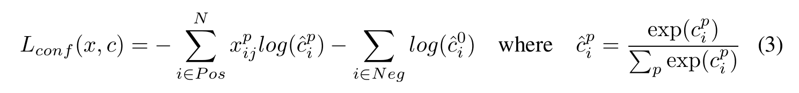

## 目标检测

> 目标检测是利用计算机视觉和图像处理技术，检测数字图像或者视频中特定类型的语义物体。 - [1]

方法分类：
- 非神经网络方法
  - Harr 特征
  - SIFT 特征
  - HOG 特征
- 神经网络方法
  - [x] **Region Proposals系列**
    - [x] R-CNN
    - [x] Fast R-CNN
    - [x] Faster R-CNN
  - [x] **SSD**
  - [ ] **SPP**
  - [ ] YOLO 系列
  - RefineDet
  - Retina-Net
  - Deformable convolutional networks 

参考资料：
- [1] [Object detection](https://en.wikipedia.org/wiki/Object_detection)

 

**待完成**
- [ ] Selective Search:
- [ ] RCNN 与 Fast RCNN 需要重新梳理

### 1. Region Proposal 系列

RCNN [1], Fast RCNN [2], Faster RCNN [3], cascade RCNN 都是基于 region proposal 方法来进行目标检测。

### **RCNN**
RCNN 将 CNN 方法引入目标检测领域， 大大提高了目标检测效果，可以说改变了目标检测领域的主要研究思路。后续的 Fast RCNN, Faster RCNN 等都是该系列文章。

**论文梳理**
- 1.模型结构
  - RCNN 的算法流程
    - 1）候选区域生成： 一张图像生成 1K~2K 个候选区域（采用 Selective Search 方法）
    - 2）特征提取： 对每个候选区域，使用深度卷积网络提取特征（CNN），尝试的网络结构有：O-Net，T-Net。特征提取的 CNN 网络实际也是进行了训练，正负样本分别为是否包含物体（IoU > 0.5 即为正样本），由于 CNN 容易过拟合，而多分类的数据较少，因此本文中没有直接利用 CNN 网络进行分类，而是采用了 SVM 进行分类。
    - 3）类别判断： 特征送入每一类的 SVM 分类器，判别是否属于该类。本文中使用的是 Linear SVM。
    - 4）位置精修： 使用回归器修正候选框位置（bbox regression）
  - RCNN 的流程图 

- 2.损失函数
- 3.训练方案
- 4.其他
  - 1）对每个候选区域，使用 CNN 提取特征前，会先将原始候选框变大(各向异性缩放，也就是原有目标区域的长宽比变了)，增加一定的 margin（p=16），以便目标区域中能有一定的背景信息。之后，会将目标区域统一缩放至 227×227 大小。
  - 2）hard negtive mining
  - 3）Bounding box regression
    - 方程（1）（2）中 dx，dy 分别乘以了 Pw 和 Ph，这样可以保证尺寸缩放不变性（在数据增广中，肯定会出现不同的缩放情况，如果采用直接差，缩放前后，直接差是不相等的，无法保证尺寸缩放不变性）。
    - 方程（3）（4）使用了指数形式，这样能够保证尺度缩放一定是正数。
    - 从方程 1-4 可以看出，dx, dy, dw, dh 是主要求得的未知量。因此，结合方程 6-9 可以确定 bbox 回归的目标方程为：（5）
    - 当 x → 0 时，有 *log(1+x)  = x*，因此 bbox 回归一般需要 Pw 和 Gw 比较接近时，才可以用线性回归模型解决该问题。

 

 

**论文贡献**：
- 速度：一般的目标检测方法是采用滑动窗口法来判断所有可能的区域，本文采用 Selective Search 方法预先提取一系列较可能是物体的候选区域。
- CNN 网络提取特征和有监督的训练：以往的目标检测算法一般都是提取人工设定的特征，本文采用神经网络的方法提取深度特征，并通过有监督的方法训练模型。

参考资料：
- [1] [Rich feature hierarchies for accurate object detection and semantic segmentation](https://arxiv.org/abs/1311.2524)
- [2] [RCNN- 将CNN引入目标检测的开山之作](https://zhuanlan.zhihu.com/p/23006190)
- [3] [【目标检测】RCNN算法详解](https://blog.csdn.net/shenxiaolu1984/article/details/51066975#fn:1)
- [4] [Object Detection with Discriminatively Trained Part Based Models](https://cs.brown.edu/people/pfelzens/papers/lsvm-pami.pdf)
- [5] [边框回归(Bounding Box Regression)详解](https://blog.csdn.net/zijin0802034/article/details/77685438)

 

### **Fast RCNN**

Fast RCNN 是基于 RCNN 网络的改进，进一步简化了算法训练的流程，提高算法运行速度和表现。

Fast RCNN 算法流程如下：
- 1.候选区域生成： 一张图像生成 1k-2k 个候选区域（采用Selective Search 方法）
- 2.物体检测分类模型：将特征提取，类别判断和 bbox 回归整合到一个网络结构中，训练 CNN 模型。

**论文梳理**
- 1.模型结构：Fast RCNN 将 RCNN 中的特征提取，物体分类和bbox回归整合到一个网络中。
  - 1）网络结构：整张图像和候选框 - 多个卷积层 - RoI pooling 层 - 全连接层 - 分类输出和bbox回归输出（都有全连接层）。
  - 2）RoI pooling 层：本质上是为了将不同尺寸的 RoI 特征转换为相同的特征图输出，保证特征图展开后具有相同的大小尺寸，能够与下层的全连接层连接。(将特征图平均分为一个合适的尺寸)
    - i.根据输入 image，将 ROI 映射到 feature map 对应位置；
    - ii.将映射后的区域划分为相同大小的 sections（sections 数量与输出的维度相同）；
    - iii.对每个 sections 进行 max pooling 操作；
  - 3）模型结构图如下所示：

- 2.损失函数：Fast RCNN 采用了多任务的损失函数
  - 1）Fast RCNN 的损失函数如公式（1）所示，包括两个部分，物体分类损失函数和 bbox 回归损失函数
  - 2）物体分类损失函数，采用的是对数损失函数：*Lcls = - logpu*
  - 3）bbox 回归损失函数，采用的 smooth L1 损失函数，如公式（2）所示

 

- 3.训练方案
- 4.其他

**论文贡献**：
- 1.one stage：Fast RCNN 将特征提取，类别判断和位置调整过程整合成一个网络，使用多任务 loss，节省时间和资源。
- 2.RoI pooling：Fast RCNN 借鉴 SPP 提出 RoI pooling 层将不同尺寸 RoI 处理成同样大小的特征图。

一些实验结果：
- 网络末端同步训练的分类和位置调整，提升准确度
- 使用多尺度的图像金字塔，性能几乎没有提高
- 倍增训练数据，能够有2%-3%的准确度提升
- 网络直接输出各类概率(softmax)，比SVM分类器性能略好
- 更多候选窗不能提升性能

参考资料：
- [1] [Fast R-CNN](https://arxiv.org/abs/1504.08083)
- [2] [【目标检测】Fast RCNN算法详解](https://blog.csdn.net/shenxiaolu1984/article/details/51036677)
- [3] [ROI Pooling层详解](https://blog.csdn.net/AUTO1993/article/details/78514071)

 

### **Faster RCNN**

Faster RCNN 是基于 Fast RCNN 网络的进一步改进，该网络将候选区域生成整合到整个训练网络流程中，进一步简化了网络结构生成，基本实现了端到端的训练过程。

**论文梳理**：
- 1.模型结构（介绍网络结构，不同之处及其作用，能说明原理最好）
  - 1）提出了目标检测网络，RPN（Region Proposal Network），这是 Faster RCNN 最大的创新点，也是 RCNN 系列中第一次采用深度学习网络进行目标检测。
  - 2）RPN 网络结构比较简单，结合 ZF 或 VGG 进行了一定调整。
  - 3）anchor：anchor 是 RPN 中很重要的一点，在特征图上，每个特征点会取一定数量的 anchor 来代表初始的检测框，anchor 的大小和数量与 anchor size 和 scale ratio 有关，论文中 anchor size 为 （128, 256, 512） 3 个尺寸，scale ratio 为（1:1, 1:2, 2:1） 3个比例。
  - 4）anchor 的平移不变性：**平移不变性的数学原理？？**？由于具有平移不变性，目标移动后，anchor box 平移后依然适用移动后的物体，不需要重新生成新的 anchor box，因此生成的候选 box 会更少。这样，网络的参数也会更少，更不容易在小数据集上过拟合。
  - 5）多尺度 anchor 回归：在多个尺度上计算 anchor box，但是在一个特征图上进行 anchor 回归。
  - 6）网络结构如下图所示，左图为检测分类两个过程的网络结构，右图为候选框检测网络，RPN。

- 2.损失函数（明确损失函数，网络的输出）
  - 1)RPN 的损失函数如公式（1）所示（在论文中，公式1实际上是整体的损失函数，但实际上这个公式也可以表示 RPN 的损失函数），包括两个部分：*Lcls* 和 *Lreg*
  - 2）*Lcls*：分类损失函数，采用的是交叉熵损失函数（适用于二分类，多分类就是对数损失），这里采用的是二分类，即判断 box 中是否有物体。
  - 3）*Lreg*：box 回归损失函数，采用是 smoothL1 损失函数（Fast RCNN中），该损失函数的目的是对从 anchor box 进行回归，以得到更加精准的 box 尺寸和位置。 公式（2）中，*x*, *xa*, *x** 分别表示预测坐标， anchor box 坐标和金标。

 

- 3.训练方案
  - 正负样本选择：为了保证负类样本过多，每次计算 loss 的时候只选择一定数量的负样本进行训练，不会将所有负类样本加入其中导致因负类过多无法收敛。
  - anchor 选择：
    - 边缘相交的 anchor 去除;
    - 正样本 anchor 选择： 与 GT 最大 IoU 的 anchor; IoU 大于一定阈值（0.7） 的 anchor。这样就是，一个 GT 可能会有多个对应的正样本 anchor。
    - 负样本 anchor： 与任一 GT 的 IoU 小于一定阈值（0.3）。
    - 测试的时候，基于 IoU 采用 nms 去重。
- 4.其他

**论文贡献**
- 1.RPN 结构的提出，让检测网络变得更加自动化。
- 2.anchor 方法的提出，后续很多网络结构都借鉴了这种方案。

参考资料：
- [1] [Faster R-CNN: Towards Real-Time Object Detection with Region Proposal Networks](https://arxiv.org/abs/1506.01497)
- [2] [Faster R-CNN](https://zhuanlan.zhihu.com/p/24916624)
- [3] [Scale invariance](https://en.wikipedia.org/wiki/Scale_invariance)
- [4] [“知其然且知其所以然”之目标检测](https://aistudio.baidu.com/aistudio/projectdetail/2166507)
- [5] [Object Detection for Dummies Part 3: R-CNN Family](https://lilianweng.github.io/lil-log/2017/12/31/object-recognition-for-dummies-part-3.html)

 

### **SSD**

SSD 算法，全称是 Single Shot MultiBox Detector，从名字可以知道该检测算法属于 one-stage 方法（Single Shot），并且是多框预测（MultiBox）。

**论文梳理**
- 1.模型结构（介绍网络结构，不同之处及其作用，能说明原理最好）
  - 1）SSD 网络在多尺度特征图上进行检测，这种结构对提高小物体的检出率有帮助（通常多次下采样之后的深层网络，小物体特征会损失）。
  - 2）卷积预测检测结果：卷积网络和全连接网络相比，卷积网络会更小，参数更少，更不容易过拟合，更加高效。
  - 3）不同尺度下，默认 box 尺寸不一样（实际上就是多尺度的 anchor）。对于不同尺度上的特征，被检测的尺寸是有范围的，因此需要事先计算好合适的尺寸和比例，以便能够更好的检测物体。
  - 4）网络结构如下图所示

- 2.损失函数（明确损失函数，网络的输出）
  - 1）该模型的损失函数如公式（1）所示，包括两个部分： *Lconf* 和 *Lloc*
  - 2）*Lloc*：是 bbox 回归损失函数，如公式（2）所示，采用的是 *smoothL1* 损失函数（与 Faster RCNN 一致）。bbox 回归，本质上是将原先设定尺寸的 anchor box （通常是与金标接近，通过 IoU 等筛选得到）向着金标 bbox 进行回归，来得到更加准确的 bbox 尺寸和位置。
  - 3）*Lconf*：是分类损失函数，如公式（3）所示，采用的是交叉熵函数，其中预测概率 *ci* 是 softmax 后得到。
  - 4）网络输出最终是：n（分类数目） + 4(box信息) 个参数。

 

 

- 3.训练方案（介绍该模型训练过程中的一些方法和策略）
  - 1）匹配策略：选择多个 overlap 大于一定阈值（0.5）的预测结果作为正类（而不是像其他论文中只选择其中一个）。
  - 2）对于默认 box，不同尺度特征层要选择合适的缩放比例和长宽比。公式（4）表示的是第 k 个特征层的缩放比。  
  - 3）困难负类减少。实际训练过程中，需要产生的 bbox 多数都是负类。为避免数据不平衡，需要通过控制一定比例去减少负类样本参与到训练过程中。
  - 4）数据增广。论文中用实验证明了数据增广比较重要。
- 4.其他

**论文贡献**
- 1.多尺度特征图进行检测，能够有效的解决小尺寸物体的检测效果。
- 2.不同尺度上，设置不同的默认 box 大小，能够更好的检测和回归box。

参考资料：
- [1] [SSD: Single Shot MultiBox Detector](https://arxiv.org/abs/1512.02325)
- [2] [目标检测|SSD原理与实现](https://zhuanlan.zhihu.com/p/33544892)

 

### **SPP**

参考资料：
- [1] [Spatial Pyramid Pooling in Deep Convolutional Networks for Visual Recognition](https://arxiv.org/abs/1406.4729)

 

### YOLO 系列

#### YOLO
从R-CNN到Fast R-CNN一直采用的思路是proposal+分类 （proposal 提供位置信息， 分类提供类别信息）精度已经很高，但是速度还不行。 YOLO提供了另一种更为直接的思路： 直接在输出层回归bounding box的位置和bounding box所属的类别(整张图作为网络的输入，把 Object Detection 的问题转化成一个 Regression 问题)

算法流程：
- 1.网络结构：增加了卷积层和全连接层来改善性能，
- 2.损失函数：损失函数比较复杂，因为 YOLO 是检测和分类在一个网络中完成，因此损失函数会更加复杂。
  - 1）第一项，
- 3.训练流程：训练过程比较麻烦
  - 1）预训练分类网络
  - 2）训练检测网络
- 4.其他

TODO：
- [ ] 如何得到 bbox 坐标的
- [ ] 分类如何得到：

#### YOLO v2

#### YOLO v3

#### YOLO v4

参考资料：
- [1] [You Only Look Once: Unified, Real-Time Object Detection](https://arxiv.org/abs/1506.02640)
- [2] [YOLO9000: Better, Faster, Stronger](https://arxiv.org/abs/1612.08242)
- [3] [YOLOv3: An Incremental Improvement](https://arxiv.org/abs/1804.02767)
- [4] [YOLOv4: Optimal Speed and Accuracy of Object Detection](https://arxiv.org/abs/2004.10934)

