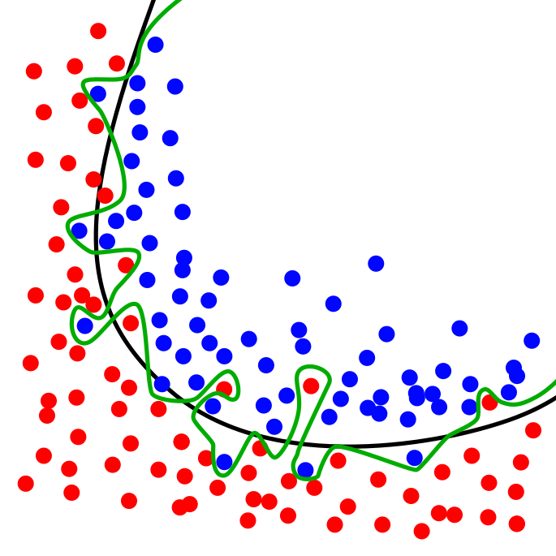
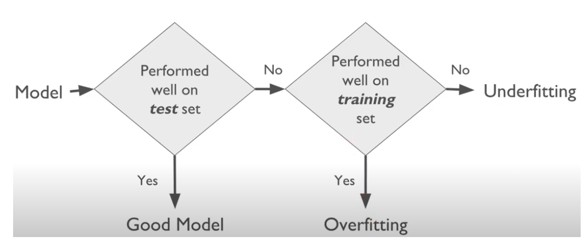
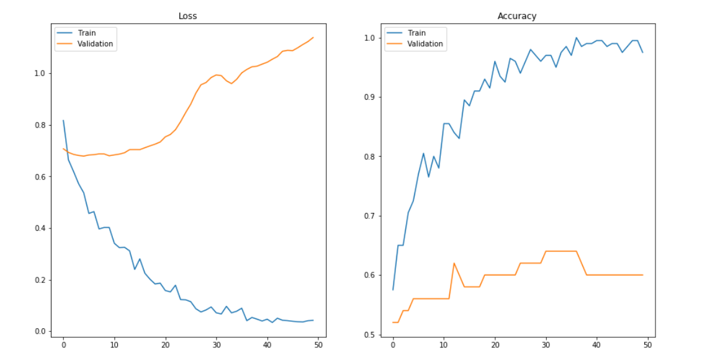
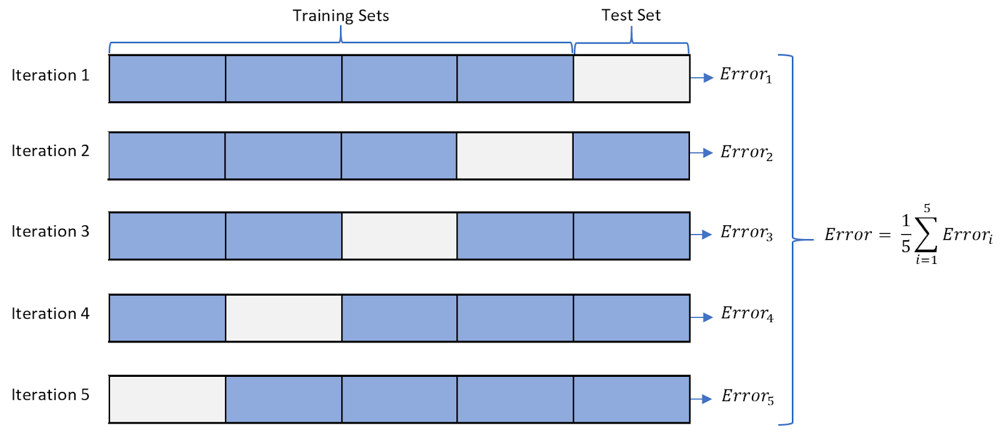

## 过拟合

### 1. 过拟合的定义

在深度学习中，过拟合通常是指模型在训练数据集上表现比较好，而在验证或者测试数据集上表现比较差。

 

### 2. 过拟合的表现

过拟合和欠拟合的比较

在训练过程中，过拟合出现时会有如下特征：
- 训练 loss 下降，但是验证 loss 不收敛。
- 训练数据集上表现好,验证数据集上表现差。

 

K-折交叉验证是用于评估模型的泛化性能的方法，常用来评估模型的过拟合问题。- [5]

 

### 3. 如何避免过拟合

常见的方法：
- 增加训练数据
- 数据增广
- 输入数据增加噪声
- 特征筛选
- K-折交叉验证
- 简化数据情况：对训练数据进行挑选，去除一些疑惑的数据
- 正则化：尽量让所有的权重都比较小，如果有些权重过大，稍微有点偏移就容易导致模型结果出现较大的差别。
- Ensembling：模型集成的方法有很多，大体是从数据和算法角度考虑。
- 及时停止训练
- 添加 dropout layer
- 简化模型

### 4. 附录

模型集成工作包括两个方面：
- 1.生成多个待集成的模型
- 2.对不同模型进行集成

#### 生成待集成模型

生成不同的模型，可以从两个方面出发：
- **1. 调整训练数据**
  - 1.1 K 折交叉验证，对训练出来的 k 个模型进行集成。
  - 1.2 用数据重采样的方法构建新训练数据集。
    - 数据欠采样
    - 数据过采样
    - SMOTE 方法 
    - 。。。
- **2. 调整模型**
  - 1.同样的模型结构，使用不同的参数随机初始化训练
  - 2.调整模型的配置参数，比如网络层数，学习率，学习策略，正则化方式等。
  - 3.在单个模型可能需要较长训练时间的时候，另一个备选方案在训练过程中定期保存最佳模型，对不同 epoch 下的模型进行集成。（这种方法的效果可能不太好）

#### 模型集成

模型集成的方法主要有：
- 1.最简单的方式就是将所有模型的预测结果取平均。
  - 稍微改进的是，取加权平均，权重根据验证集表现确定。
- 2.先对多个相同结构的模型，将其权重取平均。然后对不同结构的模型选择最好表现的进行集成。
- 3.设计一个模型，自动化学习到加权平均的过，即每个模型占的权重大小。

参考资料：
- [1] [What is Overfitting in Deep Learning and How to Avoid It](https://www.v7labs.com/blog/overfitting)
- [2] [Overfitting](https://en.wikipedia.org/wiki/Overfitting)
- [3] [4 – The Overfitting Iceberg](https://blog.ml.cmu.edu/2020/08/31/4-overfitting/)
- [4] [How to Avoid Overfitting in Deep Learning Neural Networks](https://machinelearningmastery.com/introduction-to-regularization-to-reduce-overfitting-and-improve-generalization-error/)
- [5] [Cross-validation (statistics)](https://en.wikipedia.org/wiki/Cross-validation_(statistics))
- [6] [深度学习的集成方法——Ensemble Methods for Deep Learning Neural Networks](https://www.cnblogs.com/szxspark/p/10144913.html)
- [7] [Ensemble Learning Methods for Deep Learning Neural Networks](https://machinelearningmastery.com/ensemble-methods-for-deep-learning-neural-networks/)
- [8] [A Gentle Introduction to Ensemble Learning Algorithms](https://machinelearningmastery.com/tour-of-ensemble-learning-algorithms/)

