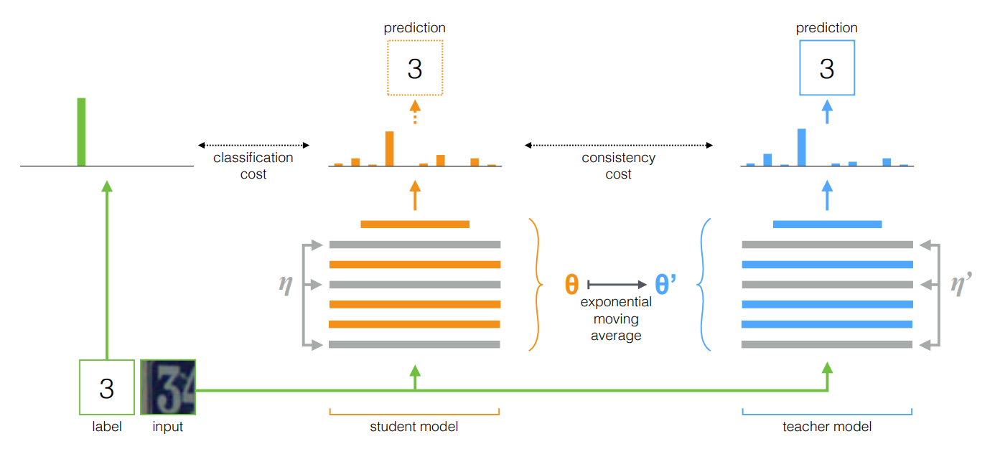

## 半监督学习（Semi-supervised Learning）

UPDATE: Nov.09 2021

### 简介

> 半监督学习是一种机器学习方法，它在训练过程中将少量标记数据与大量未标记数据相结合。半监督学习介于无监督学习（没有标记的训练数据）和监督学习（只有标记的训练数据）之间，是弱监督中的一个特例。 - [1]

半监督学习至少是基于以下一种假设 [2, 3]：
- 1.平滑假设（Smoothness Assumption）：如果两个样本 x1，x2 相似，则它们的相应输出 y1，y2 也应如此。这意味着如果两个输入相同类，并且属于同一簇，则它们相应的输出需要相近，反之亦成立。
- 2.聚类假设（Cluster Assumption）： 当两个样例位于同一聚类簇时，它们在很大的概率下有相同的类标签。这个假设的等价定义为低密度分离假设，即分类决策边界应该穿过稀疏数据区域，而避免将稠密数据区域的样例分到决策边界两侧
- 3.流形假设（Manifold Assumption）：将高维数据嵌入到低维流形中，当两个样例位于低维流形中的一个小局部邻域内时，它们具有相似的类标签。

实验表明：SSL 不满足这些假设或模型假设不正确时，无类标签的样例不仅不能对学习性能起到改进作用，反而会恶化学习性能，导致SSL的性能下降。

### 分类

半监督学习方法，根据半监督方法的应用领域，可以分为：
- 半监督分类 （Semi-Supervised Classification）
- 半监督回归（Semi-Supervised Regression）
- 半监督聚类（Semi-Supervised Clustering）
- 半监督降维（Semi-Supervised Dimensionality Reduction）

一般，半监督学习算法可分为：
- 自训练算法（self-training）：简单自训练（simple self-training），协同训练（co-training），半监督字典学习。
- 基于图的半监督算法（Graph-based Semi-supervised Learning）：标签传播算法（Label Propagation Algorithm）
- 半监督支持向量机（Semi-supervised supported vector machine）

### 深度学习半监督学习方法

深度半监督学习的一个新的研究方向是利用未标记的数据来强化训练模型，使其符合聚类假设，即学习的决策边界必须位于低密度区域。这些方法基于一个简单的概念，即如果对一个未标记的数据应用实际的扰动，则预测不应发生显著变化，因为在聚类假设下，具有不同标签的数据点在低密度区域分离。

目前深度学习中的半监督学习方法，多数是自训练算法。具体来说，给定一个未标记的数据点及其扰动的形式，目标是最小化两个输出之间的距离：

半监督学习中，用来衡量两个目标之间距离的函数我们称为一致性损失（Consistency Regularization）函数。常见的一致性损失函数有[4, 5, 6]：
- MSE（均方差误差）

- KL散度

- JS散度

其中：*D(Q||M)* 是 *DKL*， *M = (P + Q) / 2*

参考资料：
- [1] [Semi-supervised learning](https://en.wikipedia.org/wiki/Semi-supervised_learning)
- [2] [长文总结半监督学习（Semi-Supervised Learning）](https://bbs.cvmart.net/articles/3322)
- [3] [一文看懂半监督学习(Semi-supervised Learning)和自监督学习(Self-Supervised Learning)](https://www.codenong.com/cs106448533/)
- [4] [Mean squared error](https://en.wikipedia.org/wiki/Mean_squared_error)
- [5] [Kullback–Leibler divergence](https://en.wikipedia.org/wiki/Kullback%E2%80%93Leibler_divergence)
- [6] [Jensen–Shannon divergence](https://en.wikipedia.org/wiki/Jensen%E2%80%93Shannon_divergence)
- [7] [NIPS 2018 入选论文：对深度半监督学习算法的现实评价](https://bbs.cvmart.net/articles/650)
- [8] [图像分类最新技术综述论文: 21 种半监督、自监督和无监督学习方法一较高低](https://bbs.cvmart.net/articles/1551)

 

### 常见的深度学习半监督方法

#### Pi-Model & Temporal Ensembling

Pi-Model
- 1.模型结构
  - 1）Pi-Model 是对给定的 x，使用不同的正则化预测两次。Pi-Model 的扰动来自于两次预测中的正则化是不一致的。
  - 2）正则化技术（数据增广和dropout等）一般是不会改变模型的概率分布。
  - 3）Pi-Model 模型结构如下图所示：

- 2.损失函数
  - Pi-Model 的损失函数如下图公式所示，其中两次预测之间（无标签）的一致性损失函数是 MSE，有标签的损失函数是交叉熵（cross entropy）。

- 3.训练方法

Temporal Ensembling
- 1.模型结构
  - 1）Temporal Ensembling 没有使用两次预测，而是使用时序组合模型，采用的是当前模型预测结果与历史预测结果的平均值做均方差计算。
  - 2）在每次训练迭代中，当前模型预测结果通过 EMA（exponential moving averag，指数滑动平均） 方法被累加到整体输出中 *yema = α\*yema + (1-α)\*y*. 
  - 3）Temporal Ensembling 模型结构如下图所示：

- 2.损失函数
  - Temporal Ensembling 的损失函数与 Pi-Model 类似，其中两次预测之间（无标签）的一致性损失函数是 MSE，有标签的损失函数是交叉熵（cross entropy）。

- 3.训练方法

参考资料：
- [1] [Temporal Ensembling for Semi-Supervised Learning](https://openreview.net/forum?id=BJ6oOfqge&noteId=BJ6oOfqge)

 

#### Mean Teachers

- 1.模型结构
  - 1）Mean teacher 是基于 Temporal Ensembling 的改进版，Mean Teachers 采用了对 studen net 模型权重进行 EMA
  - 2）在每次训练迭代中，当前模型预测结果通过 EMA（exponential moving averag，指数滑动平均） 方法被累加到整体输出中 *yema = α\*yema + (1-α)\*y*. 
  - 3）Temporal Ensembling 模型结构如下图所示：

 

- 2.损失函数
  - Temporal Ensembling 的损失函数与 Pi-Model 类似，其中两次预测之间（无标签）的一致性损失函数是 MSE，有标签的损失函数是交叉熵（cross entropy）。

- 3.训练方法

参考资料：
- [1] [Mean teachers are better role models: Weight-averaged consistency targets improve semi-supervised deep learning results](https://arxiv.org/abs/1703.01780)

 

#### UDA

- 1.模型结构
  - 1）UDA 的核心思想是对未标记数据采用更多样化，更真实的数据增强，UDA 证明了针对性的数据增强效果明显优于无针对性的数据增强。
  - 2）UDA 针对不同的任务和实际场景，会选择不同的数据增强方式。
  - 3）UDA 的模型结构如下图所示：

- 2.损失函数
  - 1）UDA 的损失函数如公式（2）所示，包括两部分：有标签的损失函数（交叉熵）和无标签的一致性损失函数。
  - 2）UDA 的无标签损失函数如公式（1）所示，采用的是 KL 散度。

 

- 3.训练方法
  - 1）有监督的损失函数，当某一类的准确率大于某个阈值后，不再计算其损失函数，因此有标签的损失函数调整为下面公式
  - 2）训练过程中，无标签数据和有标签数据的比例，是按照退火方式逐渐增加，比例增加的方式有三种，如下面曲线图所示

 

- 4.其他

参考资料：
- [1] [Unsupervised Data Augmentation for Consistency Training](https://arxiv.org/abs/1904.12848v2)

 

#### Virtual Adversarial Training

参考资料：
- [1] [Virtual Adversarial Training: A Regularization Method for Supervised and Semi-Supervised Learning](https://arxiv.org/abs/1704.03976)

 

#### PseudoLabeling

参考资料：
- [1] [Pseudo-Label: The Simple and Efficient Semi-Supervised Learning Method for Deep Neural Networks](http://citeseerx.ist.psu.edu/viewdoc/summary?doi=10.1.1.664.3543)

 

#### Entropy Minimization

参考资料：
- [1] [Semi-supervised Learning by Entropy Minimization](https://proceedings.neurips.cc/paper/2004/file/96f2b50b5d3613adf9c27049b2a888c7-Paper.pdf)

