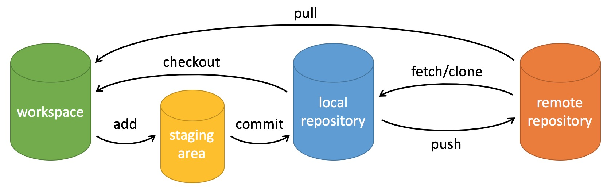

## Git 简介


**问题记录**
- [ ] git fetch 与 git pull 的差别 
- [ ] config 文件的了解熟悉
- [ ] 撤回改写的操作


### Git 的工作原理

> Git 是一个分布式版本控制软件。 - [1]

Git 是一个版本控制系统（Version Control System）。根据其特点，VCS 可以分为：
- 本地版本控制系统（Local Version Control Systems）
- 中心（Centralized Version Control Systems）
- 分布式版本控制系统（Distributed Version Control Systems）


参考资料：
- [1] [Git](https://en.wikipedia.org/wiki/Git)


#### Git 的分区
区域名称 | 位置 | 用途
--- | --- | ---
工作区(workspace) | 当前PC目录 | 日常文本操作或者查看
暂存区(stage area) | 版本库里的东西 | git add命令添加到的就是stage分区，commit就是将暂存区的目标内容提交到当前本地仓库
本地仓库(local repository) | 工作区里的隐藏目录 .git | 本地仓库，维持本地git各种管理，分支管理，暂存管理，备份管理等等
远程仓库(remote repository) | 服务端的代码 | 有时候也叫服务库，作为开发组的同步基准



参考资料:
- [Git Commands Cheetsheet](http://ashleywang.me/misc/2015/03/14/git.html)

<br>

#### gitignore

控制不必要的文件上传，主要包括：
- 操作系统自动生成的文件
- 编译生成的中间文件、可执行文件等，也就是如果一个文件是通过另一个文件自动生成的，那自动生成的文件就没必要放进版本库，比如python编译产生的.pyc文件
- 带有敏感信息的配置文件，比如存放口令的配置文件
- 占用空间很大的文件

注：实际文件名为: ```.gitignore```

gitignore的语法可以参考：
- [.gitignore](https://www.atlassian.com/git/tutorials/saving-changes/gitignore)


### Git 基础使用


- 创建仓库
- 下载仓库
- 生成仓库


```sh
# 删除代码
git rm --cached xxx  # 删除已经 add 但未 commit 的文件
git diff  # 操作

# 文件撤销相关，了解清楚
$ git reset --soft commit-id   # 应该是只消除commit，还需要测试
$ git reset --hard commit-id   # 直接回退到某个版本，包括改动
$ git reset HEAD  # 已经git add的文件，可以用这个取消add，然后用上一条命令恢复
$ git reset –hard HEAD  # 把全部更改的文件都恢复（小心使用，不然辛辛苦苦写的全没了）
```


### Getting Started
```sh
$ git config --global user.name "John Doe"
$ git config --global user.email johndoe@example.com
$ git config --global core.editor vim  # 设置 Git 默认编辑器

$ git clone http://192.168.1.144/Lung_CT/lungCT_Keras.git  # clone 代码

$ git init
$ git remote add origin https://localhost/laocai/LungCAD.git
```


##### config file
* `` /etc/gitconfig ``: 系统 config 文件, applied to every user on the system and all their repositories. Use ``--system`` to read and write data in the file.
*  ``~/.gitconfig`` or ``~/.config/git/config``: 用户 config 文件, applied to all of the repositories you work with on your system.  Use ``--global`` to read and write data in the file.
*  ``config`` (文件位置, ``.git/config``): 仓库 config 文件, specific to that single repository. Use ``--local`` to read and write data in the file.


### Git Basic
ssh-key：不用每次输密码  

#### 文件日志
```sh
.gitignore  # 设定需要忽略的文件  

# .gitignore 文件语法
*.a  # 忽略 .a 文件  
!lib.a  # 但否定忽略 lib.a, 尽管已经在前面忽略了 .a 文件 
/TODO  # 仅在当前目录下忽略 TODO 文件， 但不包括子目录下的 subdir/TODO
build/  # 忽略所有名称为build的文件夹（build下所有文件） 
/build/  # 只忽略第一级目录中，名称为build的文件夹
doc/*.txt   # 忽略 doc/notes.txt, 不包括 doc/server/arch.txt
doc/**/*.pdf   # 忽略所有的 .pdf 文件 在 doc/ directory 下的 
```

- [编写.gitignore文件的几个小技巧](http://zhaox.github.io/git/2015/12/04/gitignore-tips)

#### 文件查看
```sh
$ git log  # 查看 commit 日志, 可以根据 options 来筛选需要的日志
-p  # 详细显示
-2  # 数字可变, 表示最近几次
--stat  # 简略显示
--pretty  # log 的格式, 可以自定义, format
--grep  # 筛选需要的log
```

#### 文件操作
```sh
$ git add yourfile # add your files to commit
$ git commit -m ‘what you want to say’  # add notes
$ git push  # push to git resposity
$ git push REMOTE NAME-OF-BRANCH  # ???上传到远端吗？
$ git pull # update codes from git reposity

$ git mv  # 等同于文件重命名
```

#### Undoing Things
```sh
$ git commit --amend  # 对上一次 commit 做小的修改
# 例子
$ git commit -m 'initial commit'
$ git add forgotten_file
$ git commit --amend

# Unstaging a Staged File
$ git reset HEAD <file>  # file 不进入 stage 中, commit 时不会加入
--hard  # 硬回退, 比较危险的操作

# Unmodifying a Modified File
$ git checkout -- <file>  # file 中的修改会消失, 慎用

```

#### Working with Remotes
```sh
$ git remote  # remote reposity
-v  # 显示更详细的信息

# Adding Remote Repositories
$ git remote add <shortname> <url>

# Fetching and Pulling from Your Remotes 
$ git fetch <remote>

# Pushing to Your Remotes
$  git push <remote> <branch>

# Inspecting a Remote
$ git remote show <remote>

#Renaming and Removing Remotes
$ git remote rename <old_name> <new_name>
$ git remote rm <remote>  # 删除 remote repository. rm 可换为remove
```

#### Tagging
```sh
# Annotated Tags
$ git tag -a v1.x -m 'your message'  # tag代码

# Lightweight Tags
$ git tag v1.x-lw

# Tagging Later
$ git tag -a v1.2 9fceb02

# Sharing Tags
$ git push origin <tagname>
$ git push origin --tags  # push many tags

# Checking out Tags
$ git checkout tags
```

#### Git Aliases
```sh
# examples, 常用操作简化
$ git config --global alias.co checkout
$ git config --global alias.br branch
$ git config --global alias.ci commit
$ git config --global alias.st status

# 添加外部命令时, 需要在命令前加 !
$ git config --global alias.visual '!gitk'
```


### Git Branching

#### Branches in a Nutshell

```sh
# 创建分支
$ git branch <new-branch>

# 切换分支
$ git checkout <branch>
```

#### Basic Branching and Merging

```sh
#  创建并切换分支
$ git checkout -b <new-branch>
$ git merge <branch>

# 删除分支
$ git branch -d <branch>
```

#### Branch Management
```sh
# 查看每个分支最近一次 commit
$ git branch -v
--merged or --no-merged  # 已经(与当前分支)合并或者未合并的分支

$ git branch --no-merged <branch>  # 与<branch>分支未合并的分支
```
分支常见的操作, 便于整合代码, 团队合作.


#### Branching Workflows
对程序的开发从整体上了解, 弄清楚流程, 才能正确的进行分支管理.


#### Remote Branches
```sh
# 显示 remote  的 branch 等信息
$ git ls-remote [remote]
$ git remote show [remote]

# 更新数据, 但是不会合并, 与 git pull 有些区别
$ git fetch [remote]  


# Pushing
# 本地的 branch push 到 remote branch(不一定相同)
$ git push origin localbranch:remotebranch

# Don’t type your password every time
$ git config --global credential.helper cache


# Tracking Branches
$ git checkout -b <branch> <remote>/<branch>
$ git checkout --track <remote>/<branch>

# 当前 branch 与 remote branch 联系起来
$ git branch -u <remote>/<branch>
-u  # --set-upstream-to
$ git branch -vv  # 查看当前 tracked branch
# 更新当前所有分支
$ git fetch --all


# Pulling
# 使用 git fetch, 接着 git merge 会更好一些, 而不是直接使用 git pull`


# Deleting Remote Branches
$ git push <remote> --delete <branch>
```
了解远程分支与本地分支之间的差别, 两者之间的如何更新与同步.


#### Rebasing
```sh
# 两个基于同一个源的分支, 出现分叉后, 除了 git merge, 还可以用 git rebase
# git rebase 是改变一个分支的 commit 记录, 会更加好看一些
$ git checkout <branch>
$ git merge <branch>

# 将 client 分支(源于 server 分支) rebase 到 master 分支
$ git rebase --onto master server client

# 不需要切换分支后再进行 rebase
$ git rebase <basebranch> <topicbranch>

# rebase 之后, 再进行合并
$ git checkout master
$ git merge server

# Do not rebase commits that exist outside your repository.
```


### Git on the Server
#### The Protocols
##### 4 protocols:
* Local: 个人使用， 不太安全
* HTTP: 目前使用最多的方式， 方便。
* Secure Shell (SSH): 配置好ssh key之后，比较方便，但不支持匿名用户。
* Git: port 9418, 权限控制不合理， 很少使用。

#### Getting Git on a Server

### Distributed Git
#### Contributing to a Project
##### Commit Guidelines
1. your submissions should not contain any whitespace errors.
```sh
$ git diff --check  # 检查可能的空格错误
```
2. try to make each commit a logically separate changeset.
3. keep in mind is the commit message.

#### Maintaining a Project
##### Applying Patches from Email
```sh
$ git apply /tmp/patch-ruby-client.patch  # 利用怕提出检查数据
--check  # 检查是否干净
$ git am
```

### Git Tools


#### SSH Key
```sh
# 需要分别在服务器和本地（个人）配置， 服务器上配置公钥， 本地（个人）配置私钥
ssh-keygen -t rsa -b 1024  # 生成密钥, -t:type, -b:size, -f:filename
cat id_rsa.pub >> ~/.ssh/authorized_keys  # 服务器上配置公钥， gitlab 可以通过网页添加， 可能需要设置权限
# 本地配置私钥需要注意路径，并在 ~/.ssh/config 配置好路径
```
> [SSH-KEYGEN - GENERATE A NEW SSH KEY](https://www.ssh.com/ssh/keygen/)  

需要注意的几个地方：
* git reposity 一般有两种访问发方式： http 和 ssh， 两种访问方式中的 url 是不同的， 需要注意区分。
* ssh 访问的 url 是与 .ssh/config 中的配置有关，需要注意 Host 与 Hostname 的区别， ssh 需要注意默认端口号是否更改。
* 配置正确的 rsa key 路径。


> [How to create and configure the deployment SSH Keys for a Gitlab private repository in your Ubuntu Server](https://ourcodeworld.com/articles/read/654/how-to-create-and-configure-the-deployment-ssh-keys-for-a-gitlab-private-repository-in-your-ubuntu-server)  


### 问题记录
##### 1.Git 提示fatal: remote origin already exists   
解决办法:修改.git/.conf 配置文件中的内容。  
- > [Git 提示fatal: remote origin already exists 错误解决办法](http://blog.csdn.net/top_code/article/details/50381432) - Ricky_Fung  


##### 2.delete wrongly committed file(large file or private data) in Git history

Two ways: 
- ```git-filter-branch```
- use *BFG Repo-Cleaner* tool

For more details:
- [Reduce repository size](https://confluence.atlassian.com/bitbucket/reduce-repository-size-321848262.html#Reducerepositorysize-ReduceRep-DRAFT-Reducerepositorysize-Manuallyreviewinglargefilesinyourrepository)
- [BFG Repo-Cleaner](https://rtyley.github.io/bfg-repo-cleaner/)
